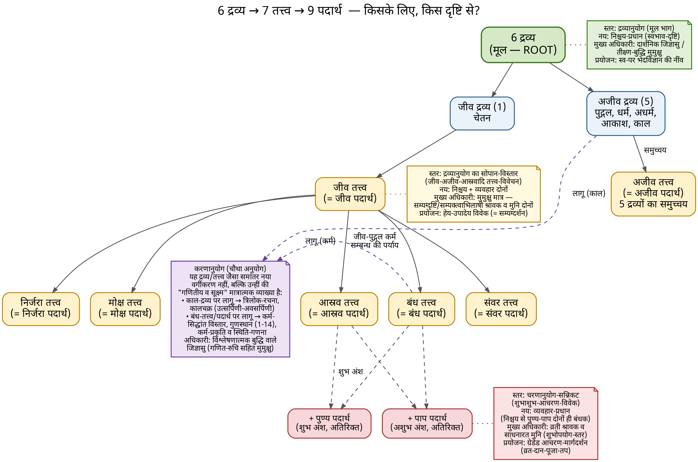
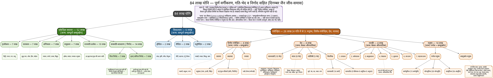
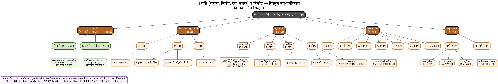
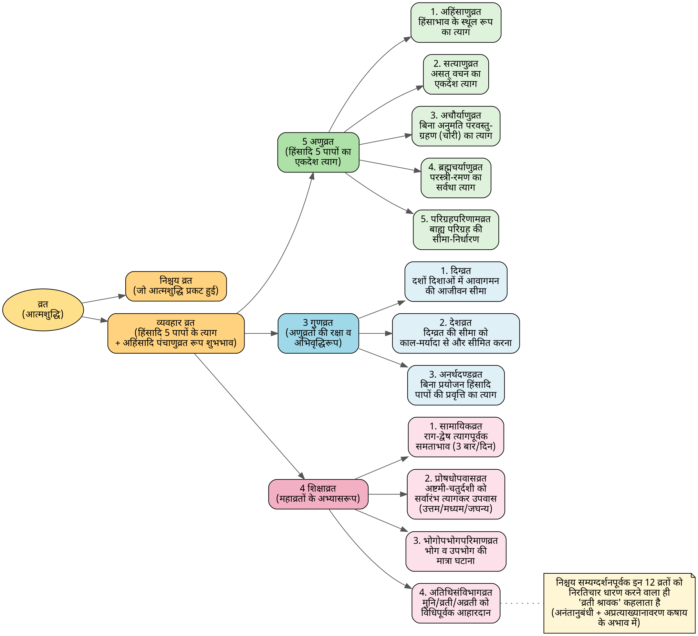
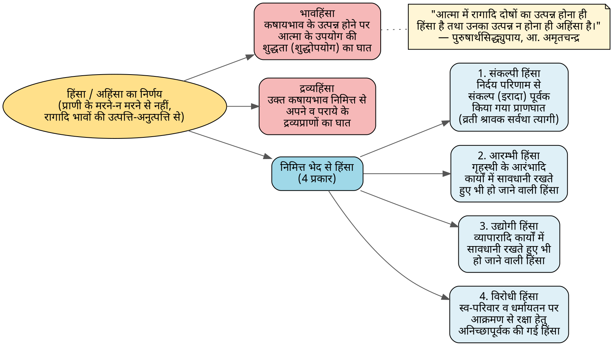
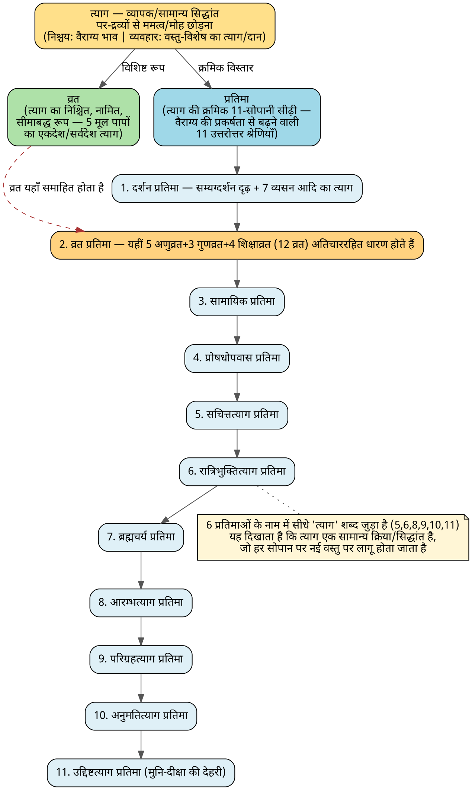
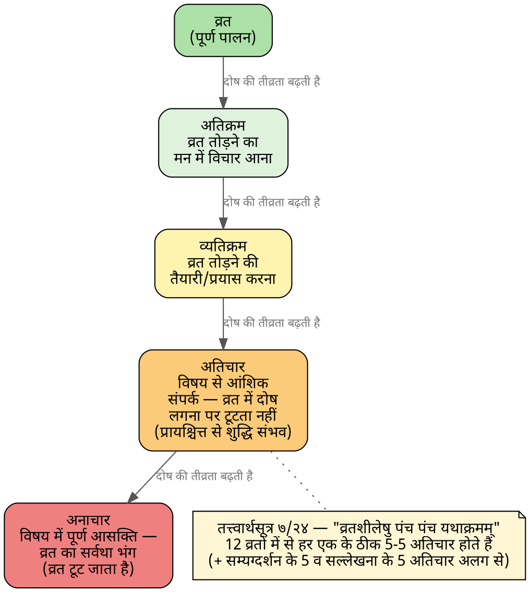
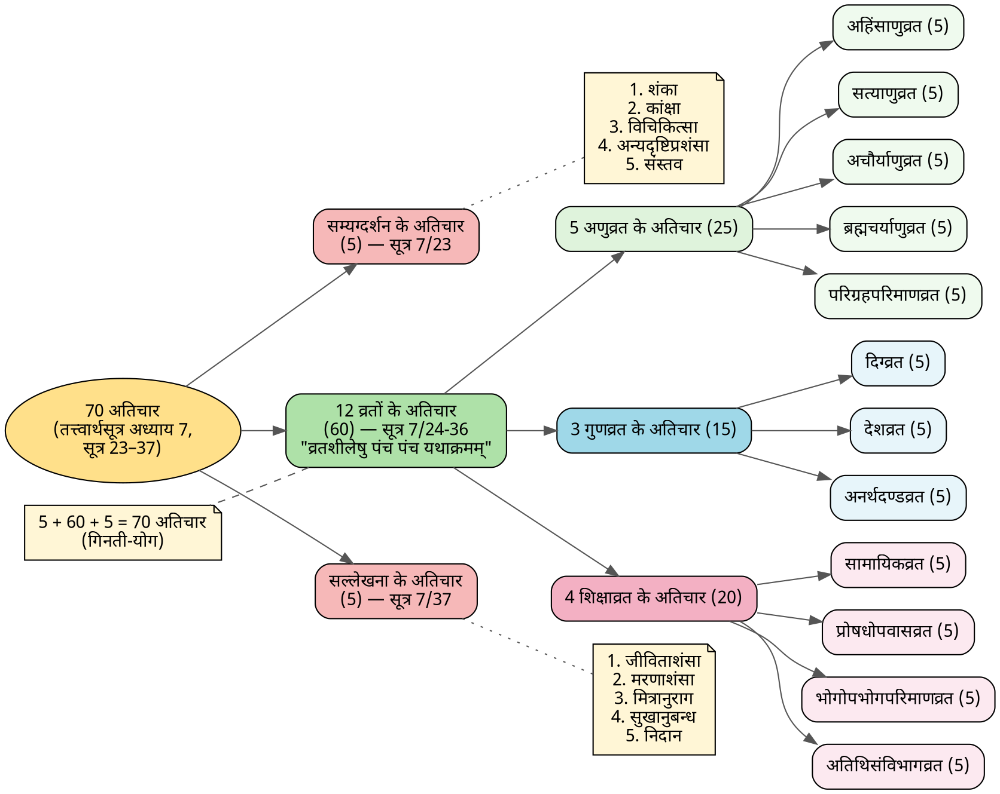
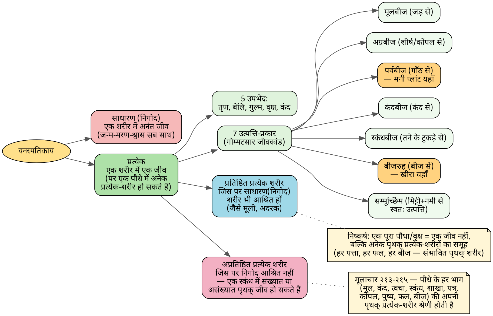

# जैन संसाधन — दिगंबर जैन सिद्धांत प्रश्नोत्तरी

दिगंबर जैन दर्शन, ब्रह्मांड-विज्ञान (कॉस्मोलॉजी), आचार-व्यवहार (व्रत/त्याग/प्रतिमा/अतिचार/वनस्पतिकाय), तथा *हरिवंश पुराण* ग्रंथ (हिंदी, *harivanshkathahin1100.pdf*) पर आधारित एक संकलित प्रश्नोत्तरी — Claude के साथ हुई शोध-वार्तालाप से संकलित।

**स्रोत-पद्धति पर टिप्पणी:** नीचे हर उत्तर को दो श्रेणियों में स्पष्ट रूप से अलग किया गया है:

- **ग्रंथ-आधारित** — केवल अपलोड किए गए *हरिवंश पुराण* PDF के मूल पाठ से लिया गया, ग्रंथ के अपने शब्दों में उद्धृत।
- **बाह्य सिद्धांत** — सामान्य दिगंबर जैन सिद्धांत, जो इस विशिष्ट ग्रंथ में नहीं मिला, बल्कि प्रामाणिक स्रोतों (jainkosh.org, सर्वार्थसिद्धि टीका सहित तत्त्वार्थसूत्र, encyclopediaofjainism.com, vidyasagar.guru आदि) से सत्यापित करके प्रस्तुत किया गया है, हर तथ्य के साथ स्रोत-उद्धरण सहित। जहाँ स्रोतों में मतभेद पाया गया या कोई विशिष्ट विवरण दूसरे स्रोत से पुष्ट नहीं हो सका, वहाँ इसे स्पष्ट रूप से चिह्नित किया गया है, न कि निश्चित तथ्य के रूप में प्रस्तुत किया गया है।

---

## विषय-सूची

1. [16 कषायों की 4 चौकड़ी तथा द्रव्य-तत्त्व-पदार्थ ढाँचा](#1-16-कषायों-की-4-चौकड़ी-तथा-द्रव्य-तत्त्व-पदार्थ-ढाँचा)
2. [द्रव्य-तत्त्व-पदार्थ का पैरेंट-चाइल्ड आरेख](#2-द्रव्य-तत्त्व-पदार्थ-का-पैरेंट-चाइल्ड-आरेख)
3. [क्या आस्रव व संवर भी जीव-अजीव की तरह पदार्थ में अलग से गिने जाते हैं?](#3-क्या-आस्रव-व-संवर-भी-जीव-अजीव-की-तरह-पदार्थ-में-अलग-से-गिने-जाते-हैं)
4. [पदार्थ अंतिम वर्गीकरण होने पर भी द्रव्य व तत्त्व का क्या महत्व है?](#4-पदार्थ-अंतिम-वर्गीकरण-होने-पर-भी-द्रव्य-व-तत्त्व-का-क्या-महत्व-है)
5. [द्रव्य, तत्त्व, पदार्थ — कौन किसके लिए है?](#5-द्रव्य-तत्त्व-पदार्थ--कौन-किसके-लिए-है)
6. [करणानुयोग यहाँ कहाँ फिट होता है?](#6-करणानुयोग-यहाँ-कहाँ-फिट-होता-है)
7. [84 लाख योनियों का वर्गीकरण](#7-84-लाख-योनियों-का-वर्गीकरण)
8. [84 लाख योनि में हर लाख-संख्या का उच्च-स्तरीय अर्थ](#8-84-लाख-योनि-में-हर-लाख-संख्या-का-उच्च-स्तरीय-अर्थ)
9. [84 लाख योनि का सोपानिक (hierarchical) आरेख](#9-84-लाख-योनि-का-सोपानिक-hierarchical-आरेख)
10. [साधारण/निगोद शरीर में अनंत जीव](#10-साधारणनिगोद-शरीर-में-अनंत-जीव)
11. [सम्मूर्च्छन जन्म को मनुष्य से परे अन्य श्रेणियों तक विस्तारित करना](#11-सम्मूर्च्छन-जन्म-को-मनुष्य-से-परे-अन्य-श्रेणियों-तक-विस्तारित-करना)
12. [64 ऋद्धियाँ](#12-64-ऋद्धियाँ)
13. [5 ज्ञान — अधिकारी, प्रत्यक्ष/परोक्ष एवं क्षेत्र](#13-5-ज्ञान--अधिकारी-प्रत्यक्षपरोक्ष-एवं-क्षेत्र)
14. [सम्यग्दर्शन के प्रकार, अवधि व गति-पात्रता](#14-सम्यग्दर्शन-के-प्रकार-अवधि-व-गति-पात्रता)
15. [क्षायिक सम्यक्त्व प्राप्ति की प्रक्रिया](#15-क्षायिक-सम्यक्त्व-प्राप्ति-की-प्रक्रिया)
16. [तीर्थंकर जन्माभिषेक प्रक्रिया](#16-तीर्थंकर-जन्माभिषेक-प्रक्रिया)
17. [परिग्रह के प्रकार — अंतरंग व बाह्य](#17-परिग्रह-के-प्रकार--अंतरंग-व-बाह्य)
18. [5 अणुव्रत तथा हिंसा का वर्गीकरण (ग्रंथ से, पृष्ठ 206-210)](#18-5-अणुव्रत-तथा-हिंसा-का-वर्गीकरण-ग्रंथ-से-पृष्ठ-206-210)
19. [व्रत, त्याग व प्रतिमा में अंतर](#19-व्रत-त्याग-व-प्रतिमा-में-अंतर)
20. [12 व्रतों के अतिचार](#20-12-व्रतों-के-अतिचार)
21. [सभी 70 अतिचारों का वर्गीकरण](#21-सभी-70-अतिचारों-का-वर्गीकरण)
22. [प्रत्येक वनस्पति में शरीर/जीव की गिनती](#22-प्रत्येक-वनस्पति-में-शरीरजीव-की-गिनती)
23. [ग्रंथ-अध्ययन आरंभ व निर्देश](#23-ग्रंथ-अध्ययन-आरंभ-व-निर्देश)
24. [प्रत्येक अध्याय का पात्र-वृक्ष व अध्यायों-के-पार संबंध](#24-प्रत्येक-अध्याय-का-पात्र-वृक्ष-व-अध्यायों-के-पार-संबंध)
25. [किसी भी ग्रंथ के लिए पुनः-उपयोगी विश्लेषण-प्रॉम्प्ट](#25-किसी-भी-ग्रंथ-के-लिए-पुनः-उपयोगी-विश्लेषण-प्रॉम्प्ट)
26. [गृहस्थ के षट्‌कर्म तथा बारह व्रत](#26-गृहस्थ-के-षट्‌कर्म-तथा-बारह-व्रत)
27. [सम्यग्दर्शन के 25 दोष](#27-सम्यग्दर्शन-के-25-दोष)
28. [1 सागर (सागरोपम) कितने वर्षों के बराबर है](#28-1-सागर-सागरोपम-कितने-वर्षों-के-बराबर-है)
29. [PDF से बाहर के प्रश्नों हेतु प्रामाणिक स्रोतों की उपलब्धता](#29-pdf-से-बाहर-के-प्रश्नों-हेतु-प्रामाणिक-स्रोतों-की-उपलब्धता)
30. [स्वयंभूरमण समुद्र](#30-स्वयंभूरमण-समुद्र)
31. [दिगंबर जैन दर्शन में समय की सभी इकाइयों का सारांश](#31-दिगंबर-जैन-दर्शन-में-समय-की-सभी-इकाइयों-का-सारांश)
32. [समय-इकाइयों का सोपानिक (hierarchical) चार्ट](#32-समय-इकाइयों-का-सोपानिक-hierarchical-चार्ट)
33. [उपरोक्त चार्ट का शीर्षक](#33-उपरोक्त-चार्ट-का-शीर्षक)
34. [नवधा भक्ति](#34-नवधा-भक्ति)
35. [प्रॉम्प्ट में बाह्य प्रामाणिक स्रोतों को शामिल करना (पहला संशोधन)](#35-प्रॉम्प्ट-में-बाह्य-प्रामाणिक-स्रोतों-को-शामिल-करना-पहला-संशोधन)
36. [सम्यग्दर्शन के 25 दोष/8 अंग — उदाहरण व प्रसिद्ध व्यक्तित्व सहित](#36-सम्यग्दर्शन-के-25-दोष8-अंग--उदाहरण-व-प्रसिद्ध-व्यक्तित्व-सहित)
37. [तालिकाओं को docx में as-is कॉपी करने योग्य बनाना](#37-तालिकाओं-को-docx-में-as-is-कॉपी-करने-योग्य-बनाना)
38. [पिछले प्रश्न के लिए तालिका](#38-पिछले-प्रश्न-के-लिए-तालिका)
39. [तालिकाओं में डिफ़ॉल्ट रूप से दृश्य बॉर्डर](#39-तालिकाओं-में-डिफ़ॉल्ट-रूप-से-दृश्य-बॉर्डर)
40. [अष्ट मूलगुण, सप्त व्यसन, विकलत्रय, बारह व्रत व ग्यारह प्रतिमा](#40-अष्ट-मूलगुण-सप्त-व्यसन-विकलत्रय-बारह-व्रत-व-ग्यारह-प्रतिमा)
41. [प्रॉम्प्ट में स्रोत-उद्धरण की आवश्यकता जोड़ना (दूसरा संशोधन)](#41-प्रॉम्प्ट-में-स्रोत-उद्धरण-की-आवश्यकता-जोड़ना-दूसरा-संशोधन)
42. [धन्यकुमार का जन्म तथा ग्रंथ-रचना का विवरण](#42-धन्यकुमार-का-जन्म-तथा-ग्रंथ-रचना-का-विवरण)
43. [वीर संवत्, विक्रम संवत् व ईस्वी सन् के बीच संबंध](#43-वीर-संवत्-विक्रम-संवत्-व-ईस्वी-सन्-के-बीच-संबंध)
44. [वर्ष 2026 को इस संबंध में जोड़ना, तथा CE से VNS/VS निकालने की विधि](#44-वर्ष-2026-को-इस-संबंध-में-जोड़ना-तथा-ce-से-vnsvs-निकालने-की-विधि)
45. [बहिरंग व अंतरंग तप](#45-बहिरंग-व-अंतरंग-तप)
46. [बाह्य व अंतरंग परिग्रह](#46-बाह्य-व-अंतरंग-परिग्रह)
47. [22 परीषह, पंडित-मरण (सल्लेखना) के 3 भेद, तथा षट् लेश्या](#47-22-परीषह-पंडित-मरण-सल्लेखना-के-3-भेद-तथा-षट्-लेश्या)
48. [चौदह गुणस्थान](#48-चौदह-गुणस्थान)
49. [ध्यान के भेद — आर्त, रौद्र, धर्म्य, शुक्ल (प्रशस्त-अप्रशस्त, हेय-उपादेय एवं प्रथमानुयोग उदाहरण)](#49-ध्यान-के-भेद--आर्त-रौद्र-धर्म्य-शुक्ल-प्रशस्त-अप्रशस्त-हेय-उपादेय-एवं-प्रथमानुयोग-उदाहरण)

---

## 1. 16 कषायों की 4 चौकड़ी तथा द्रव्य-तत्त्व-पदार्थ ढाँचा

> *मूल अनौपचारिक प्रश्न: "kashay ke 3 chaukdi janya paapbhav? Importance of 7 tatva, 6 drava, 9 padarth as per attached screenshot"*

**औपचारिक प्रश्न:** 16 कषायों को उनके द्वारा उत्पन्न पापभाव के आधार पर 4 चौकड़ियों में कैसे वर्गीकृत किया जाता है, और 6 द्रव्य, 7 तत्त्व तथा 9 पदार्थ के ढाँचे का सैद्धांतिक महत्व क्या है?

**उत्तर (बाह्य सिद्धांत):**

16 कषायों को तीव्रता व कर्म-प्रभाव के आधार पर 4 चौकड़ियों में बाँटा गया है:

| चौकड़ी | कषाय | प्रभाव |
|---|---|---|
| अनंतानुबंधी | क्रोध, मान, माया, लोभ | सम्यग्दर्शन को पूर्णतः रोकती है; नरक-गति-योग्य कर्म बाँधती है |
| अप्रत्याख्यानावरण | क्रोध, मान, माया, लोभ | आंशिक (श्रावक-स्तरीय) व्रत/त्याग को भी रोकती है |
| प्रत्याख्यानावरण | क्रोध, मान, माया, लोभ | पूर्ण (मुनि-स्तरीय) महाव्रत को रोकती है |
| संज्वलन | क्रोध, मान, माया, लोभ | केवल यथाख्यात-चारित्र (पूर्ण आचरण) को रोकती है |

6 द्रव्य (जीव, पुद्गल, धर्म, अधर्म, आकाश, काल), 7 तत्त्व (जीव, अजीव, आस्रव, बंध, संवर, निर्जरा, मोक्ष), तथा 9 पदार्थ (यही 7 तत्त्व + पुण्य + पाप) — ये तीनों एक-दूसरे में समाहित संरचना बनाते हैं (पूर्ण संबंध व आरेख के लिए आगे के प्रश्न देखें)।

---

## 2. द्रव्य-तत्त्व-पदार्थ का पैरेंट-चाइल्ड आरेख

> *मूल प्रश्न: "modify overlapping table like an umbrella (parent child hierarchy)" / "so, can I say, this is the structure from leaf to nodes in parent/child? Padarth - Tatva -> Dravya"*

**औपचारिक प्रश्न:** क्या पदार्थ (सबसे सूक्ष्म/leaf स्तर), तत्त्व, और द्रव्य के बीच के संबंध को एक स्पष्ट पैरेंट-चाइल्ड सोपानिक आरेख के रूप में दिखाया जा सकता है, जो Word दस्तावेज़ में भी उपयोग किया जा सके?

**उत्तर:** हाँ — पदार्थ सबसे सूक्ष्म (leaf) स्तर पर है, तत्त्व मध्य-स्तरीय समूहीकरण है, और द्रव्य सबसे व्यापक तात्त्विक श्रेणी है। नीचे इस पूरे पदानुक्रम का अंतिम व सबसे संपूर्ण संस्करण दिया गया है (श्रावक/मुनि-अधिकारी annotation तथा करणानुयोग के cross-link सहित):



---

## 3. क्या आस्रव व संवर भी जीव-अजीव की तरह पदार्थ में अलग से गिने जाते हैं?

> *मूल प्रश्न: "आस्रव, संवर are not annotated as padarth along with tatva like jeev and ajeev?"*

**औपचारिक प्रश्न:** क्या आस्रव व संवर तत्त्व भी जीव व अजीव की भाँति स्वतंत्र रूप से पदार्थ के रूप में गिने जाते हैं?

**उत्तर (बाह्य सिद्धांत, Encyclopedia of Jainism से सत्यापित):** हाँ। सभी 7 तत्त्व (जीव, अजीव, आस्रव, बंध, संवर, निर्जरा, मोक्ष) बिना किसी परिवर्तन के 9 में से 7 पदार्थों में समाहित होते हैं — आस्रव व बंध "पुण्य व पाप में बदल" नहीं जाते। बल्कि पुण्य व पाप इन्हीं 7 तत्त्वों के ऊपर **2 अतिरिक्त** पदार्थ हैं: *"इन्हीं सात तत्त्वों में पुण्य और पाप को मिला देने से नव पदार्थ कहलाते हैं"* (Encyclopedia of Jainism) — यानी 7+2=9, किसी तत्त्व का प्रतिस्थापन नहीं।

---

## 4. पदार्थ अंतिम वर्गीकरण होने पर भी द्रव्य व तत्त्व का क्या महत्व है?

> *मूल प्रश्न: "then in jainsim, why is the significance of dravya, tatva, when padarth is the final leaf level classification?"*

**औपचारिक प्रश्न:** यदि पदार्थ सबसे सूक्ष्म (leaf-level) वर्गीकरण है, तो जैन दर्शन में द्रव्य व तत्त्व को अलग, उच्चतर श्रेणियों के रूप में बनाए रखने का सैद्धांतिक महत्व क्या है?

**उत्तर (बाह्य सिद्धांत):** हर स्तर 4-अनुयोग ढाँचे में एक अलग प्रयोजन पूरा करता है —

- **द्रव्यानुयोग** मुख्यतः **द्रव्य** का अध्ययन करता है — विश्व के मूल, शाश्वत तत्त्व (तत्त्वमीमांसा/ऑन्टोलॉजी)।
- **प्रथमानुयोग** व **करणानुयोग** क्रमशः कथा व मात्रात्मक संदर्भों में **तत्त्व** से जुड़ते हैं।
- **चरणानुयोग** सर्वाधिक सीधे **पदार्थ** से संबंधित है — क्योंकि पुण्य व पाप (7 तत्त्वों से आगे के 2 पदार्थ) ही श्रावक या मुनि के आचरण, व्रत व नैतिकता को नियंत्रित करते हैं।

अतः द्रव्य, तत्त्व, पदार्थ एक ही सूची की पुनरावृत्ति नहीं हैं — हर एक अलग-अलग प्रयोजन (तत्त्वमीमांसा बनाम कथा बनाम गणना बनाम आचरण) के लिए अलग अनुयोग का प्रवेश-बिंदु है।

---

## 5. द्रव्य, तत्त्व, पदार्थ — कौन किसके लिए है?

> *मूल प्रश्न: "also add anootation, which of these (dravya, tatva, padarth) are for whom - Shravak, muni, vyavhaar, nishyay, दार्शनिक जिज्ञासु, मुमुक्षु, और व्रती श्रावक etc?"*

**औपचारिक प्रश्न:** द्रव्य, तत्त्व व पदार्थ — इन तीनों में से कौन-सी श्रेणी मुख्यतः किस अधिकारी-वर्ग (दार्शनिक जिज्ञासु, मुमुक्षु, व्रती श्रावक, मुनि, या व्यवहार/निश्चय दृष्टि) के लिए है?

**उत्तर (बाह्य सिद्धांत, अनुभाग 2 का आरेख देखें):**

| श्रेणी | मुख्य अधिकारी |
|---|---|
| **द्रव्य** | दार्शनिक जिज्ञासु — मूल तत्त्वमीमांसा, निश्चय-प्रधान |
| **तत्त्व** | मुमुक्षु — मोक्षमार्ग की संरचना (आस्रव→बंध बनाम संवर→निर्जरा→मोक्ष) |
| **पदार्थ** | व्रती श्रावक / मुनि — व्यवहार-प्रधान, क्योंकि पुण्य/पाप सीधे आचरण को नियंत्रित करते हैं |

---

## 6. करणानुयोग यहाँ कहाँ फिट होता है?

> *मूल प्रश्न: "and where karnayuyog fits in here?"*

**औपचारिक प्रश्न:** करणानुयोग (जैन शास्त्र का मात्रात्मक/गणनात्मक विभाग) द्रव्य-तत्त्व-पदार्थ ढाँचे में कहाँ फिट होता है?

**उत्तर:** करणानुयोग कोई चौथी समानांतर श्रेणी नहीं, बल्कि पहले से मौजूद पदानुक्रम के विशिष्ट बिंदुओं पर लगाया गया एक **क्रॉस-कटिंग मात्रात्मक लेंस** है — उदाहरणस्वरूप, यह **अजीव-द्रव्य** (काल-गणना, लोक-रचना) तथा **बंध-तत्त्व** (कर्म-सिद्धांत, गुणस्थान-गणना) के लिए संख्यात्मक विवरण प्रदान करता है। यह cross-link अनुभाग 2 के आरेख में बैंगनी बिंदीदार रेखा द्वारा दिखाया गया है।

---

## 7. 84 लाख योनियों का वर्गीकरण

> *मूल प्रश्न: "classfication of 84 lakh yoniyon"*

**औपचारिक प्रश्न:** जैन ब्रह्मांड-विज्ञान में 84 लाख योनियों (जन्म-प्रजाति श्रेणियों) का संपूर्ण वर्गीकरण क्या है?

**उत्तर (बाह्य सिद्धांत):**

| श्रेणी | संख्या (लाख में) |
|---|---|
| एकेन्द्रिय — स्थावर (पृथ्वी/जल/अग्नि/वायु/वनस्पति) | 52 |
| विकलत्रय (दो/तीन/चार इन्द्रिय) | 6 |
| पंचेन्द्रिय (तिर्यंच, मनुष्य, देव, नारकी) | 26 |
| **कुल** | **84** |

पूर्ण सोपानिक विवरण अनुभाग 9 में देखें।

---

## 8. 84 लाख योनि में हर लाख-संख्या का उच्च-स्तरीय अर्थ

> *मूल प्रश्न: "also add brief insights of types of each number in lakhs (very high level), like whats the meaning of 14 lakhs for मनुष्य in पंचेन्द्रिय (पूर्ण 5 इन्द्रिय)"*

**औपचारिक प्रश्न:** कृपया संक्षेप में बताएं कि हर लाख-संख्या वास्तव में क्या वर्गीकृत करती है — उदाहरण के लिए, पंचेन्द्रिय में मनुष्य को दी गई 14 लाख योनियाँ वास्तव में क्या दर्शाती हैं?

**उत्तर (बाह्य सिद्धांत):** हर लाख-संख्या व्यक्तियों की शाब्दिक गिनती नहीं, बल्कि उस गति के भीतर **योनि की विशिष्ट किस्मों** (species/जन्म-प्रकार) का वर्गीकरण है। मनुष्य के लिए 14 लाख योनियाँ कर्मभूमि/भोगभूमि/अंतर्द्वीपज उत्पत्ति तथा गर्भज/सम्मूर्च्छन जन्म-प्रकारों के अनुसार मानव-जन्म की विविधता को वर्गीकृत करती हैं (पूर्ण मनुष्य उप-वृक्ष के लिए अनुभाग 9 का आरेख देखें)। इसी तरह अन्य लाख-संख्याएँ (पृथ्वीकाय 7, जलकाय 7, अग्निकाय 7, वायुकाय 7, प्रत्येक-वनस्पति 10, साधारण-वनस्पति 14, द्वीन्द्रिय/त्रीन्द्रिय/चतुरिन्द्रिय प्रत्येक 2, तिर्यंच पंचेन्द्रिय 4, देव 4, नारकी 4) उस योनि-श्रेणी की आंतरिक विविधता दर्शाती हैं, न कि जनसंख्या-गणना।

---

## 9. 84 लाख योनि का सोपानिक (hierarchical) आरेख

> *मूल प्रश्न: "create hierarchical image of 84 yoniyan now, with all the explanations, you have given for the same"*

**औपचारिक प्रश्न:** कृपया अब तक दिए गए सभी स्पष्टीकरणों को सम्मिलित करते हुए 84 लाख योनियों का एक सोपानिक आरेख तैयार करें।

**उत्तर:** नीचे पूर्ण विस्तृत आरेख है (निगोद नित्य/इतर विभाजन, तिर्यंच पंचेन्द्रिय के जलचर/स्थलचर/नभचर उप-वृक्ष, देव के भवनवासी/व्यंतर/ज्योतिषी/वैमानिक उप-वृक्ष, 7 नारकी भूमियाँ, तथा मनुष्य के गर्भज/सम्मूर्च्छन जन्म-प्रकार सहित):



एक अधिक संक्षिप्त, docx-अनुकूल संस्करण (केवल निगोद/तिर्यंच/देव/नारकी/मनुष्य पर केंद्रित):



---

## 10. साधारण/निगोद शरीर में अनंत जीव

> *मूल प्रश्न: "in वनस्पति — साधारण/निगोद category, which type of anat jeev are in 1 vanaspati - 1 शरीर में अनंत जीव एक साथ रहते हैं"*

**औपचारिक प्रश्न:** वनस्पतिकाय की साधारण/निगोद श्रेणी में एक ही शरीर में एक साथ किस प्रकार के अनंत जीव निवास करते हैं?

**उत्तर (बाह्य सिद्धांत):** साधारण (निगोद) वनस्पति में, एक शरीर एक साथ **अनंतानंत** निगोद-जीवों द्वारा साझा किया जाता है, जिनका जन्म, मृत्यु व श्वास सब समकालिक (synchronized) होता है — यह प्रत्येक-वनस्पति से भिन्न है, जहाँ हर शरीर में केवल एक जीव रहता है। जैन ग्रंथों में सामान्य उदाहरण मूली व अदरक जैसी जड़-सब्जियाँ दी जाती हैं। पूर्ण संरचनात्मक सिद्धांत (प्रतिष्ठित/अप्रतिष्ठित प्रत्येक शरीर) के लिए, जो इसे प्रत्येक-वनस्पति से अलग करता है, अनुभाग 22 देखें।

---

## 11. सम्मूर्च्छन जन्म को मनुष्य से परे अन्य श्रेणियों तक विस्तारित करना

> *मूल प्रश्न: "add these details in yoni_tree_full.. so samoorchan should be applicable to other categories also not just manushya?"*

**औपचारिक प्रश्न:** कृपया 84-योनि आरेख को अद्यतन करें ताकि यह दिखाया जा सके कि सम्मूर्च्छन (स्वतःस्फूर्त, बिना मैथुन के) जन्म केवल मनुष्य तक सीमित नहीं, बल्कि अन्य श्रेणियों में भी लागू होता है।

**उत्तर (बाह्य सिद्धांत, तत्त्वार्थसूत्र 2/21 के अनुसार):** जन्म के 3 प्रकार हैं — सम्मूर्च्छन (स्वतःस्फूर्त), गर्भज (गर्भ से), तथा औपपातिक (तत्क्षण स्वतःस्फूर्त, केवल देव/नारकी में)। सम्मूर्च्छन केवल मनुष्य तक सीमित नहीं — यह एकेन्द्रिय-स्थावर, विकलत्रय तथा तिर्यंच-पंचेन्द्रिय श्रेणियों में भी लागू होता है; केवल देव व नारकी विशुद्ध रूप से औपपातिक हैं, और मनुष्य/तिर्यंच-पंचेन्द्रिय गर्भज+सम्मूर्च्छन का मिश्रण हैं। यह भेद पूर्ण आरेख (अनुभाग 9) में हर समूह के शीर्षक पर टैग किया गया है।

---

## 12. 64 ऋद्धियाँ

> *मूल प्रश्न: "64 ridhiyan"*

**औपचारिक प्रश्न:** जैन सिद्धांत में उन्नत मुनियों को प्राप्त होने वाली 64 ऋद्धियाँ (अलौकिक शक्तियाँ) क्या हैं, और इन्हें कैसे वर्गीकृत किया गया है?

**उत्तर (बाह्य सिद्धांत):** 64 ऋद्धियाँ 8 श्रेणियों में विभाजित हैं:

| # | श्रेणी | संख्या | उदाहरण |
|---|---|---|---|
| 1 | बुद्धि ऋद्धि | 18 | अवधिज्ञान-ऋद्धि, मनःपर्ययज्ञान-ऋद्धि, केवलज्ञान-ऋद्धि, बीजबुद्धि, कोष्ठबुद्धि, पदानुसारी (3 उपप्रकार), संभिन्नश्रोतृत्व, 5 दूर-ऋद्धियाँ, दश/चतुर्दशपूर्वित्व, प्रज्ञाश्रमणत्व (4 उपप्रकार), प्रत्येकबुद्धत्व, वादित्व |
| 2 | विक्रिया ऋद्धि | 11 | अणिमा, महिमा, लघिमा, गरिमा, प्राप्ति, प्राकाम्य, ईशित्व, वशित्व, अप्रतिघात, अन्तर्धान, कामरूपित्व |
| 3 | क्रिया/चारण ऋद्धि | 9 | आकाशगामित्व, जलचारण, जंघाचारण, फल-पत्र-पुष्पचारण, अग्निशिखा-धूमचारण, मेघचारण, तन्तुचारण, ज्योतिश्चारण, मरुच्चारण |
| 4 | तप ऋद्धि | 7 | उग्रतप, दीप्ततप, तप्ततप, महातप, घोरतप, घोरपराक्रमतप, घोरब्रह्मचर्यतप |
| 5 | बल ऋद्धि | 3 | मनोबल, वचनबल, कायबल |
| 6 | औषधि ऋद्धि | 8 | आमर्षौषधि, क्ष्वेल, जल्ल, मल, सर्वौषधि, आस्यनिर्विष, दृष्टिनिर्विष आदि |
| 7 | रस ऋद्धि | 6 | आशीर्विष रस, दृष्टिविष, क्षीरस्रावी, मधुस्रावी, सर्पिस्रावी, अमृतस्रावी |
| 8 | क्षेत्र/अक्षीण ऋद्धि | 2 | अक्षीणमहानस, अक्षीणमहालय |
| | **कुल** | **64** | |

*⚠️ टिप्पणी: विभिन्न जैन ग्रंथों में हर श्रेणी की गिनती में मामूली अंतर पाया जाता है (कुछ आगम 5 जितनी कम, कुछ 50 तक लब्धियाँ गिनते हैं); ऊपर दी 18/11/9/7/3/8/6/2=64 की गिनती को jainkosh.org, Encyclopedia of Jainism व vidyasagar.guru के बीच सर्वाधिक सहमति मिली, जो तिलोयपण्णत्ति, धवला व गोम्मटसार जीवकांड को मूल ग्रंथ मानते हैं। पूर्ण 64-नाम सूची की सटीकता किसी मुद्रित चौंसठ-ऋद्धि-विधान ग्रंथ से पुनः जाँची जानी चाहिए।*

**स्रोत:** [ऋद्धि — जैनकोष](https://www.jainkosh.org/wiki/ऋद्धि) | [Riddhi — Encyclopedia of Jainism](https://encyclopediaofjainism.com/ऋद्धि-riddhi/) | [wisdomlib.org — Riddhi definition](https://www.wisdomlib.org/definition/riddhi) | [चौंसठ ऋद्धियाँ — vidyasagar.guru](https://vidyasagar.guru/paathshala/jain-kakshayein/swadhyay-path/shramano-ki-chamatkarik-shakti-chousat-riddhiyan/)

---

## 13. 5 ज्ञान — अधिकारी, प्रत्यक्ष/परोक्ष एवं क्षेत्र

> *मूल प्रश्न: "mati, shrut, avadhi, all type of gyan, who can have these, which kaal, they are possible etc.."*

**औपचारिक प्रश्न:** पाँचों ज्ञान (मति, श्रुत, अवधि, मनःपर्यय, केवल) में से हर एक के लिए — कौन उसे प्राप्त करने का अधिकारी है, क्या वह प्रत्यक्ष है या परोक्ष, और उसका क्षेत्र/अवधि क्या है?

**उत्तर (बाह्य सिद्धांत, जैनकोष तथा तत्त्वार्थसूत्र 1.9-1.24 के अनुसार):**

| ज्ञान | प्रत्यक्ष/परोक्ष | अधिकारी | विशेष क्षेत्र |
|---|---|---|---|
| **मति-ज्ञान** | परोक्ष | सभी जीव, मिथ्यादृष्टि सहित (उनमें इसे कुमति कहा जाता है) | 5 इन्द्रिय + मन द्वारा |
| **श्रुत-ज्ञान** | परोक्ष | सभी जीव, मिथ्यादृष्टि सहित (उनमें इसे कुश्रुत कहा जाता है) | शास्त्र/शब्द-आधारित |
| **अवधि-ज्ञान** | प्रत्यक्ष (देश-प्रत्यक्ष) | सच्चा अवधि केवल **सम्यग्दृष्टि** में (मिथ्यादृष्टि में इसे अवधि नहीं, **विभंगज्ञान** कहते हैं)। भव-प्रत्यय (जन्मजात) केवल देव/नारकी में; गुण-प्रत्यय (अर्जित) मनुष्य/तिर्यंच में | केवल मूर्तिक (भौतिक) पदार्थों को जानता है; देशावधि से लेकर सर्वावधि तक क्षेत्र |
| **मनःपर्यय-ज्ञान** | प्रत्यक्ष (अनिन्द्रिय) | **सर्वाधिक सीमित**: केवल **7वें गुणस्थान (अप्रमत्त-संयत)** से आगे के मानव मुनि — देव, नारकी, तिर्यंच व यहाँ तक कि गृहस्थ श्रावक भी वर्जित। उपप्रकार: ऋजुमति (पतनशील) व विपुलमति (अपतनशील) | केवल मनुष्य-क्षेत्र तक सीमित; ऋजुमति ~1 गव्यूति-1 योजन, विपुलमति संपूर्ण मनुष्य-लोक तक |
| **केवल-ज्ञान** | प्रत्यक्ष (पारमार्थिक) | केवल **केवली** (4 घातिया कर्मों का नाश) | सभी द्रव्यों/पर्यायों/कालों का पूर्ण, समग्र व स्थायी ज्ञान |

**स्रोत:** [ज्ञान — जैनकोष](https://www.jainkosh.org/wiki/ज्ञान) | [अवधिज्ञान — जैनकोष](https://www.jainkosh.org/wiki/अवधिज्ञान) | [मन:पर्यय — जैनकोष](https://www.jainkosh.org/wiki/मन:पर्यय) | [तत्त्वार्थसूत्र 1.9 — wisdomlib.org](https://www.wisdomlib.org/jainism/book/tattvartha-sutra-with-commentary/d/doc1084592.html) | [तत्त्वार्थसूत्र 1.23 — wisdomlib.org](https://www.wisdomlib.org/jainism/book/tattvartha-sutra-with-commentary/d/doc1084606.html)

---

## 14. सम्यग्दर्शन के प्रकार, अवधि व गति-पात्रता

> *मूल प्रश्न: "types of samyakdarshan, duration, when is it temporary, permanent etc? which all gati, one can attain?"*

**औपचारिक प्रश्न:** सम्यग्दर्शन के विभिन्न प्रकार, उनकी अवधि (अस्थायी बनाम स्थायी), तथा हर प्रकार किन-किन गतियों में प्राप्त किया जा सकता है?

**उत्तर (बाह्य सिद्धांत, जैनकोष के अनुसार):**

कारण के आधार पर: **निसर्गज** (बिना उपदेश के स्वतः) बनाम **अधिगमज** (गुरु के उपदेश से)।

कर्म-स्थिति के आधार पर:

| प्रकार | अवधि | गति-पात्रता |
|---|---|---|
| औपशमिक | अंतर्मुहूर्त (निश्चित, संक्षिप्त — अंत में अवश्य गिरता है) | चारों गति |
| सासादन | न्यूनतम 1 समय, अधिकतम 6 आवली (शेष अवधि, अंततः मिथ्यात्व में समाप्त) | देव (भवनवासी-ग्रैवेयक), मनुष्य, पंचेन्द्रिय तिर्यंच (पर्याप्त/अपर्याप्त दोनों); नारकी केवल पर्याप्त अवस्था में |
| क्षायोपशमिक/वेदक | अंतर्मुहूर्त से 66 सागरोपम तक (बार-बार जन्मों में बना रहने पर) | मनुष्य, तिर्यंच, देव, नारकी (संज्ञी पंचेन्द्रिय) |
| क्षायिक | स्थायी — सादि-अनंता, कभी नहीं गिरता | **केवल कर्मभूमि के मनुष्य द्वारा** केवली/श्रुतकेवली के पादमूल में प्रारंभ; प्राप्ति के बाद अगले जन्मों में भी (पूर्व आयु-बंध अनुसार) बना रहता है |

**स्रोत:** [सम्यग्दर्शन — जैनकोष](https://www.jainkosh.org/wiki/सम्यग्दर्शन) | [सासादन — जैनकोष](https://jainkosh.org/wiki/सासादन) | [क्षायिक सम्यक्त्व — जैनकोष](https://www.jainkosh.org/wiki/क्षायिक_सम्यक्त्व) | [चरणानुयोग पाठ 29 — vidyasagar.guru](https://vidyasagar.guru/paathshala/jinsaraswati/charnanuyog/lesson-29-samyak-darshan/)

---

## 15. क्षायिक सम्यक्त्व प्राप्ति की प्रक्रिया

> *मूल प्रश्न: "how to attain क्षायिक सम्यक्त्व"*

**औपचारिक प्रश्न:** क्षायिक सम्यक्त्व (सम्यग्दर्शन का स्थायी, अपतनशील रूप) प्राप्त करने की प्रक्रिया क्या है?

**उत्तर (बाह्य सिद्धांत, जैनकोष व vidyasagar.guru के अनुसार):**

**नष्ट की जाने वाली 7 कर्म-प्रकृतियाँ:** अनंतानुबंधी क्रोध, मान, माया, लोभ (4) + मिथ्यात्व + सम्यक्प्रकृति (सम्यक्त्व-मोहनीय) + सम्यग्मिथ्यात्व (मिश्र-प्रकृति) — अंतिम 3 मिलकर दर्शनमोहनीय कहलाती हैं।

**दो-चरण प्रक्रिया:**
1. **विसंयोजना** — 4 अनंतानुबंधी कषायों का विसंयोजन/रूपांतरण (अभी नष्ट नहीं, कमज़ोर कषाय-रूपों में बदलना)।
2. **दर्शनमोहनीय-क्षपणा** — शेष 3 दर्शनमोहनीय प्रकृतियों का वास्तविक नाश।

**अंतर्निहित 3-करण तंत्र:**
1. **अधःप्रवृत्तकरण** — प्रारंभिक तैयारी-शुद्धि, हर क्षण क्रमशः शुद्धतर होती हुई।
2. **अपूर्वकरण** — अभूतपूर्व शुद्धि; क्रमिक स्थिति-घात, अनुभाग-घात, गुण-संक्रमण होते हैं (अभी वास्तविक क्षय नहीं)।
3. **अनिवृत्तिकरण** — अंतिम अपरिवर्तनीय चरण; यहीं **अंतरकरण** किया जाता है, जो 1-अंतर्मुहूर्त का एक अंतराल बनाता है जिसमें दर्शनमोहनीय का उदय नहीं हो सकता — यही अंतराल सम्यक्त्व को संभव बनाता है।

यह पूरी प्रक्रिया केवल **कर्मभूमि के मनुष्य** द्वारा, केवली या श्रुतकेवली के समक्ष खड़े होकर, प्रारंभ की जा सकती है।

**स्रोत:** [चरणानुयोग पाठ 29 — vidyasagar.guru](https://vidyasagar.guru/paathshala/jinsaraswati/charnanuyog/lesson-29-samyak-darshan/) | [दर्शनमोहनीय निर्देश — जैनकोष](https://www.jainkosh.org/wiki/दर्शनमोहनीय_निर्देश) | [विसंयोजना — जैनकोष](https://www.jainkosh.org/wiki/विसंयोजना) | [अपूर्वकरण — जैनकोष](https://www.jainkosh.org/wiki/अपूर्वकरण) | [अंतरकरण — जैनकोष](https://www.jainkosh.org/wiki/अंतरकरण)

---

## 16. तीर्थंकर जन्माभिषेक प्रक्रिया

> *मूल प्रश्न: "describe teerthankar baalak abhishek process with all specialities of the process, who takes parts, what are the special characterstic of each event, character in that?"*

**औपचारिक प्रश्न:** तीर्थंकर के जन्माभिषेक समारोह का वर्णन करें — इसमें कौन भाग लेता है, घटनाओं का क्रम क्या है, तथा हर चरण की विशेषताएँ क्या हैं?

**उत्तर — ग्रंथ-आधारित (PDF से, नेमिनाथ की अपनी जीवनी, "प्रमुख पात्रों का परिचय"):**

> *"तीर्थंकर नामकर्म के साथ बंधे पुण्यकर्म के प्रभाव से सौधर्म इन्द्र आदि देव-देवेन्द्रों ने उनका विशेष प्रकार से जन्मोत्सव मनाया। सुमेरु पर्वत के शिखर पर ले जाकर हर्षोल्लासपूर्वक १००८ कलशों से क्षीर-सागर के निर्मल निर्जन्तुक जल से उनका जन्माभिषेक किया गया। नेमिकुमार परमशान्त, अत्यन्त सुन्दर और १००८ शुभलक्षणों से युक्त श्याम वर्ण होते हुए भी अत्यन्त आकर्षक व्यक्तित्व के धनी और अतुल्यबल के धारक थे। वे जन्म से ही मति-श्रुत-अवधिज्ञान के धारक भी थे।"*

**पूरक — बाह्य सिद्धांत (सामान्य दिगंबर परंपरा, जैनकोष व हरिवंशपुराण सर्ग 38 के अनुसार):**

1. जन्म के तुरंत बाद इन्द्र (सौधर्मेन्द्र) अवधिज्ञान से इसे जानकर देवों के बड़े समूह सहित पृथ्वी पर उतरते हैं।
2. शिशु को ऐरावत हाथी पर बिठाकर सुमेरु पर्वत ले जाया जाता है।
3. शिशु को सुमेरु शिखर पर **पांडुक-शिला** पर बिठाया जाता है।
4. देव क्षीरसागर से जल लाते हैं; इन्द्र **1,008 कलशों** से अभिषेक करते हैं।
5. शिशु को वस्त्र-आभूषण से सजाया जाता है, तथा इन्द्र व सभी स्वर्गों के देव मिलकर हर्षोल्लासपूर्वक पृथ्वी पर लौटते हैं।

*⚠️ टिप्पणी: इन्द्र द्वारा शिशु के बल की परीक्षा हेतु सुमेरु पर पैर के अंगूठे से दबाव डालने की लोकप्रिय कथा (सामान्यतः महावीर से जुड़ी) किसी भी परामर्शित दिगंबर स्रोत से सत्यापित नहीं हो सकी, अतः यहाँ शामिल नहीं की गई। भाग लेने वाले इन्द्रों की सटीक संख्या/वर्ग (लोकप्रिय रूप से कभी-कभी "64 इन्द्र" कहा जाता है) भी किसी प्राथमिक स्रोत से स्वतंत्र रूप से पुष्ट नहीं हो सकी।*

---

## 17. परिग्रह के प्रकार — अंतरंग व बाह्य

> *मूल प्रश्न: "type of parigrah, antrang and baahya"*

**औपचारिक प्रश्न:** परिग्रह (आसक्ति/स्वामित्व) के प्रकार क्या हैं, अंतरंग व बाह्य वर्गीकरण सहित?

**उत्तर (बाह्य सिद्धांत / ग्रंथ में परिग्रहपरिणामव्रत के वर्णन में भी संदर्भित, अनुभाग 18 देखें):**

**14 आंतरिक परिग्रह:** मिथ्यात्व + 3 वेद (स्त्री/पुरुष/नपुंसक) + 6 नोकषाय (हास्य, रति, अरति, शोक, भय, जुगुप्सा) + 4 कषाय (क्रोध, मान, माया, लोभ) = 14

**10 बाह्य परिग्रह:** क्षेत्र-वास्तु (भूमि/भवन), हिरण्य-सुवर्ण (चाँदी/सोना), धन-धान्य (धन/अनाज), दासी-दास (सेवक), कुप्य (घरेलू वस्तुएँ/बर्तन)

---

## 18. 5 अणुव्रत तथा हिंसा का वर्गीकरण (ग्रंथ से, पृष्ठ 206-210)

> *मूल प्रश्न: "update explanations for all anuvrat and hinsa from PDF page# 210 starting"*

**औपचारिक प्रश्न:** ग्रंथ के पृष्ठ 210 से प्रारंभ होने वाले अनुभाग ("बारह अणुव्रतों का स्वरूप") के अनुसार, 12 व्रतों (5 अणुव्रत + 3 गुणव्रत + 4 शिक्षाव्रत) तथा हिंसा के वर्गीकरण की अद्यतन व्याख्या दें।

**उत्तर — पूर्णतः ग्रंथ-आधारित (harivanshkathahin1100.pdf, पृष्ठ २०६–२१०):**

ग्रंथ व्रत को स्वयं परिभाषित करता है: *"जो आत्मशुद्धि प्रकट हुई, उसे निश्चय व्रत कहते हैं और उक्त आत्मशुद्धि के सद्भाव में जो हिंसादि पंच पापों के त्याग तथा अहिंसादि पंचाणुव्रत धारण करने रूप शुभभाव होते हैं, उन्हें व्यवहार व्रत कहते हैं।"*



हिंसा पर ग्रंथ कहता है: *"राग-द्वेषादि भाव न करके, योग्यतम आचरण करते हुए सावधानी रखने पर भी यदि किसी जीव का घात हो जाये, तो वह हिंसा नहीं है। सारांश यह है कि हिंसा और अहिंसा का निर्णय प्राणी के मरने या न मरने से नहीं, रागादि भावों की उत्पत्ति और अनुत्पत्ति से है।"* हिंसा को निमित्त-भेद से 4 प्रकारों में वर्गीकृत किया गया है:



ग्रंथ सत्याणुव्रत (4 प्रकार के असत्य सहित), अचौर्याणुव्रत, ब्रह्मचर्याणुव्रत, परिग्रहपरिणामव्रत, 3 गुणव्रत (दिग्व्रत, देशव्रत, अनर्थदण्डव्रत), तथा 4 शिक्षाव्रत (सामायिक, प्रोषधोपवास — उत्तम/मध्यम/जघन्य श्रेणियों सहित, भोगोपभोगपरिमाण, अतिथिसंविभाग) की भी पूर्ण परिभाषाएँ देता है, और अंत में कहता है: *"निश्चय सम्यग्दर्शनपूर्वक उक्त बारह व्रतों को निरतिचार धारण करने वाला श्रावक ही व्रती श्रावक कहलाता है।"*

---

## 19. व्रत, त्याग व प्रतिमा में अंतर

> *मूल प्रश्न: "difference in vrat, tyag and pratima"*

**औपचारिक प्रश्न:** व्रत, त्याग व प्रतिमा के बीच वैचारिक तथा सोपानिक (hierarchical) अंतर क्या है?

**उत्तर (बाह्य सिद्धांत — यह विशिष्ट तुलना ग्रंथ में नहीं है):**

- **त्याग** — "त्यागने/छोड़ने" का सबसे व्यापक, सामान्य सिद्धांत (निश्चय अर्थ में — सभी पर-द्रव्यों से मोह हटाना; व्यवहार अर्थ में — दान देना, या किसी विशिष्ट वस्तु का त्याग)।
- **व्रत** — त्याग का एक विशिष्ट, बंद, नामित रूप: 5 मूल पापों से विरति, गृहस्थ के लिए 12 व्रतों के रूप में औपचारिक (तत्त्वार्थसूत्र 7.1: *"हिंसानृतस्तेयाब्रह्मपरिग्रहेभ्यो विरतिर्व्रतम्"*)।
- **प्रतिमा** — त्याग की क्रमिक गहराई वाली 11-सोपानी सीढ़ी। महत्वपूर्ण बात यह है कि **व्रत, प्रतिमा के समानांतर नहीं बल्कि उसी के भीतर समाहित है** — 12 व्रत ठीक प्रतिमा #2 (व्रत प्रतिमा) का ही स्वरूप हैं, रत्नकरंडश्रावकाचार श्लोक 138 के अनुसार।



11 प्रतिमाएँ: 1. दर्शन, 2. व्रत, 3. सामायिक, 4. प्रोषधोपवास, 5. सचित्तत्याग, 6. रात्रिभुक्तित्याग, 7. ब्रह्मचर्य, 8. आरम्भत्याग, 9. परिग्रहत्याग, 10. अनुमतित्याग, 11. उद्दिष्टत्याग।

**स्रोत:** [व्रत — जैनकोष](https://www.jainkosh.org/wiki/व्रत) | [त्याग — जैनकोष](https://www.jainkosh.org/wiki/त्याग) | [व्रत प्रतिमा — जैनकोष](https://jainkosh.org/wiki/व्रत_प्रतिमा) | [श्रावक भेद व लक्षण — जैनकोष](https://www.jainkosh.org/wiki/श्रावक_भेद_व_लक्षण) | [श्रावक — जैनकोष](https://www.jainkosh.org/wiki/श्रावक) | [The Eleven Pratima — Jainstudy](https://jainstudy.wordpress.com/2018/04/09/the-eleven-pratima/)

---

## 20. 12 व्रतों के अतिचार

> *मूल प्रश्न: "atichar in vrat"*

**औपचारिक प्रश्न:** 12 व्रतों में से हर एक से जुड़े अतिचार (दोष/स्खलन) क्या हैं?

**उत्तर (बाह्य सिद्धांत, तत्त्वार्थसूत्र 7.24-7.36):**

अतिचार = व्रत में आंशिक, असावधानीवश हुई त्रुटि जो व्रत को कमज़ोर तो करती है पर पूर्णतः तोड़ती नहीं (अनाचार — पूर्ण/जानबूझकर तोड़ना — से भिन्न)। मूल सूत्र: *"व्रतशीलेषु पंच पंच यथाक्रमम्"* — हर व्रत के ठीक 5 अतिचार।



| व्रत | 5 अतिचार |
|---|---|
| अहिंसाणुव्रत | बंध, वध, छेद, अतिभारारोपण, अन्नपाननिरोध |
| सत्याणुव्रत | मिथ्योपदेश, रहोऽभ्याख्यान, कूटलेखक्रिया, न्यासापहार, साकारमन्त्रभेद |
| अचौर्याणुव्रत | स्तेनप्रयोग, स्तेनाहृतादान, विरुद्धराज्यातिक्रम, हीनाधिकमानोन्मान, प्रतिरूपकव्यवहार |
| ब्रह्मचर्याणुव्रत | परविवाहकरण, इत्वरिकापरिगृहीतागमन, इत्वरिकाऽपरिगृहीतागमन, अनंगक्रीड़ा, कामतीव्राभिनिवेश |
| परिग्रहपरिमाणव्रत | क्षेत्र-वास्तु, हिरण्य-सुवर्ण, धन-धान्य, दासी-दास, कुप्य (सीमा-उल्लंघन) |
| दिग्व्रत | ऊर्ध्व/अधो/तिर्यक्-व्यतिक्रम, क्षेत्रवृद्धि, स्मृत्यन्तराधान |
| देशव्रत | आनयन, प्रेष्यप्रयोग, शब्दानुपात, रूपानुपात, पुद्गलक्षेप |
| अनर्थदण्डव्रत | कन्दर्प, कौत्कुच्य, मौखर्य, असमीक्ष्याधिकरण, उपभोगपरिभोगानर्थक्य |
| सामायिकव्रत | काय/वचन/मनोयोगदुष्प्रणिधान, अनादर, स्मृत्यनुपस्थान |
| प्रोषधोपवासव्रत | अप्रत्यवेक्षित-अप्रमार्जित मल-मूत्रोत्सर्ग/आदान/संस्तरोपक्रमण, अनादर, स्मृत्यनुपस्थान |
| भोगोपभोगपरिमाणव्रत | सचित्ताहार, सचित्तसंबंधाहार, सम्मिश्राहार, अभिषवाहार, दुष्पक्वाहार |
| अतिथिसंविभागव्रत | सचित्तनिक्षेप, सचित्तापिधान, परव्यपदेश, मात्सर्य, कालातिक्रम |

*⚠️ सत्याणुव्रत के 5वें अतिचार में ग्रंथ-भेद है: तत्त्वार्थसूत्र साकारमन्त्रभेद देता है; रत्नकरंडश्रावकाचार इसके स्थान पर पैशुन्य देता है।*

**स्रोत:** [अतिचार — जैनकोष](https://www.jainkosh.org/wiki/अतिचार) | [अनाचार — जैनकोष](https://www.jainkosh.org/wiki/अनाचार) | [तत्त्वार्थसूत्र 7.23-7.37 (सर्वार्थसिद्धि टीका सहित) — wisdomlib.org](https://www.wisdomlib.org/jainism/book/tattvartha-sutra-with-commentary)

---

## 21. सभी 70 अतिचारों का वर्गीकरण

> *मूल प्रश्न: "70 अतिचार classfication"*

**औपचारिक प्रश्न:** सम्यग्दर्शन, 12 व्रतों तथा सल्लेखना में फैले सभी 70 अतिचारों को कैसे वर्गीकृत किया गया है?

**उत्तर (बाह्य सिद्धांत, तत्त्वार्थसूत्र 7.23-7.37):**



- **सम्यग्दर्शन के अतिचार (5)** — शंका, कांक्षा, विचिकित्सा, अन्यदृष्टिप्रशंसा, संस्तव
- **12 व्रतों के अतिचार (60)** — अनुभाग 20 देखें (5 अणुव्रत के 25 + 3 गुणव्रत के 15 + 4 शिक्षाव्रत के 20)
- **सल्लेखना के अतिचार (5)** — जीविताशंसा, मरणाशंसा, मित्रानुराग, सुखानुबन्ध, निदान

**कुल: 5 + 60 + 5 = 70 अतिचार**, तत्त्वार्थसूत्र अध्याय 7 के अनुसार।

**स्रोत:** [सल्लेखना — जैनकोष](https://www.jainkosh.org/wiki/सल्लेखना) | [सम्यग्दर्शन — जैनकोष](https://www.jainkosh.org/wiki/सम्यग्दर्शन)

---

## 22. प्रत्येक वनस्पति में शरीर/जीव की गिनती

> *मूल प्रश्न: "in वनस्पति — प्रत्येक category. If I plant a cucumber seed from a tree full of cucumber, how many shareer, I should assume in one tree then? same for moneyplan example, I can pluck one leaf and plan to grow another money plant tree"*

**औपचारिक प्रश्न:** वनस्पतिकाय की प्रत्येक श्रेणी में, एक ही पौधे में कितने पृथक् शरीर (व्यक्तिगत जीव-निवास) मान लेने चाहिए — उदाहरणस्वरूप, अनेक फलों वाली खीरे की बेल, या पत्ती/कटिंग से उगाया गया मनी प्लांट (Pothos)?

**उत्तर (बाह्य सिद्धांत, गोम्मटसार जीवकांड 186/423, धवला 14/5-6, मूलाचार 213-215):**



गोम्मटसार जीवकांड सीधे कहता है: *"अप्रतिष्ठित प्रत्येक: एक स्कंध में संख्यात या असंख्यात जीव हो सकते हैं"* — एक दिखने वाला पौधा-पिंड स्वयं संख्यात या असंख्यात पृथक् प्रत्येक-शरीरों का समूह हो सकता है, एक शरीर नहीं। मूलाचार आगे हर पौधे-भाग (मूल, कंद, त्वचा, स्कंध, शाखा, पत्र, कोंपल, पुष्प, फल, बीज) को अपनी पृथक् प्रत्येक-शरीर श्रेणी देता है।

खीरा (जैनकोष, भक्ष्याभक्ष्य के अनुसार) पुष्ट रूप से **प्रत्येक** श्रेणी में आता है (अनंतकाय में नहीं), अतः यहाँ "अनेक पृथक् शरीर" वाला सिद्धांत लागू होता है, निगोद वाला "एक शरीर में अनंत जीव" नहीं।

**व्यावहारिक अनुप्रयोग (⚠️ किसी सीधे उद्धृत शास्त्र-सूत्र से परे, तर्कसंगत विस्तार):** खीरे की बेल के लिए, पारंपरिक समझ हर फल को अपना पृथक् प्रत्येक-शरीर मानती है, और उस फल के भीतर हर पके बीज को भी एक और पृथक् संभावित प्रत्येक-शरीर/जीव-स्थान — इसलिए अनेक फल व बीज वाली बेल में तदनुरूप बड़ी संख्या में पृथक् शरीर होते हैं (शास्त्र में इसका कोई निश्चित अंक-सूत्र नहीं दिया गया)। मनी प्लांट के लिए, तने की गाँठ से कटिंग द्वारा प्रवर्धन गोम्मटसार के 7 मान्यता-प्राप्त पौधा-उत्पत्ति प्रकारों में से **पर्वबीज** (गाँठ-उत्पत्ति) श्रेणी से मेल खाता है; चूँकि जैन तत्त्वमीमांसा जीव को अनादि-अनंत (न बनने वाला, न मिटने वाला) मानती है, कटिंग से उगने वाला नया पौधा किसी पहले से विद्यमान संसारी जीव के नए शरीर में जन्म लेने को दर्शाता है, नई आत्मा की उत्पत्ति को नहीं — और कटिंग तोड़ने की क्रिया स्वयं उस पौधे-ऊतक में पहले से निवासरत जीव के प्रति एक हिंसा-क्रिया (द्रव्यहिंसा) मानी जाएगी।

**स्रोत:** [वनस्पति व प्रत्येक वनस्पति सामान्य निर्देश — जैनकोष](https://www.jainkosh.org/wiki/वनस्पति_व_प्रत्येक_वनस्पति_सामान्य_निर्देश) | [प्रतिष्ठित व अप्रतिष्ठित प्रत्येक शरीर परिचय — जैनकोष](https://www.jainkosh.org/wiki/प्रतिष्ठित_व_अप्रतिष्ठित_प्रत्येक_शरीर_परिचय) | [निगोद निर्देश — जैनकोष](https://jainkosh.org/wiki/निगोद_निर्देश) | [भक्ष्याभक्ष्य — जैनकोष](https://www.jainkosh.org/wiki/भक्ष्याभक्ष्य)

---

---

# श्री धन्यकुमार चरित्र — प्रश्नोत्तरी

> **इस सेशन के बारे में:** यह भाग "श्री धन्यकुमार चरित्र" ग्रंथ (PDF, 86 पृष्ठ; भट्टारक सकलकीर्ति रचित; हिंदी अनुवाद पं. उदयलाल कासलीवाल; प्रकाशक: दिगंबर जैन पुस्तकालय, सूरत) पर केंद्रित एक पृथक् सेशन से लिया गया है।
>
> **⚠️ पारदर्शिता-सूचना (शब्दशः बनाम पुनर्निर्मित):** इस सेशन के मध्य में एक कॉन्टेक्स्ट-सारांशीकरण (summarization) हुआ था। इस कारण नीचे दिए प्रश्नों में से **केवल अंतिम दो उत्तर** — क्रम **47 ("22 परीषह, पंडित-मरण के 3 भेद, षट् लेश्या")** तथा **48 ("चौदह गुणस्थान")** — मूल उत्तर के **शब्दशः (verbatim)** समान हैं। बाकी सभी उत्तर (क्रम 23–46) सेशन के संक्षिप्त सार (summary) के आधार पर **पुनर्निर्मित (reconstructed)** किए गए हैं — विषयवस्तु व तथ्य वही मूल दिगंबर जैन सिद्धांत के अनुरूप रखे गए हैं, परंतु शब्द-रचना मूल सेशन के उत्तर से भिन्न हो सकती है। सभी **प्रश्न** (मूल अनौपचारिक व औपचारिक दोनों) सेशन-सार में शब्दशः सुरक्षित थे, अतः यथावत हैं। जहाँ पुनर्निर्माण अनिश्चित रहा, वहाँ स्पष्ट रूप से चिह्नित किया गया है।

---

## 23. ग्रंथ-अध्ययन आरंभ व निर्देश

> *मूल प्रश्न: "this is famous digambar jain granth on dhanya kumar. Please go through and analyze. I will ask questions, when you area ready. You need to give your answers in hindi. Just use this PDF to answer and not your old knowledge or web."*

**औपचारिक प्रश्न:** कृपया संलग्न प्रसिद्ध दिगंबर जैन ग्रंथ "श्री धन्यकुमार चरित्र" (PDF) का पूर्ण अध्ययन व विश्लेषण करें। इसके पश्चात् प्रश्न पूछे जाएंगे — कृपया सभी उत्तर हिंदी में दें, तथा केवल इसी PDF की मूल सामग्री के आधार पर दें, न कि पूर्व ज्ञान या वेब-खोज के आधार पर।

**उत्तर *(पुनर्निर्मित)*:** संपूर्ण 86-पृष्ठ की PDF सात अधिकारों (अध्यायों) में पढ़ी गई, हर अधिकार के पात्रों व घटनाओं को नोट किया गया। इसके बाद से सभी कथा/पात्र-संबंधी प्रश्नों के उत्तर केवल इसी ग्रंथ के आधार पर, तथा हिंदी में दिए गए।

---

## 24. प्रत्येक अध्याय का पात्र-वृक्ष व अध्यायों-के-पार संबंध

> *मूल प्रश्न: "create a important characters tree of each chapter and also, how each character is related to other character beyond chapter"*

**औपचारिक प्रश्न:** कृपया ग्रंथ के प्रत्येक अध्याय के महत्वपूर्ण पात्रों का एक वृक्ष (character tree) तैयार करें, तथा यह भी स्पष्ट करें कि अध्यायों के पार (beyond chapter) प्रत्येक पात्र अन्य पात्रों से किस प्रकार संबंधित है।

**उत्तर *(पुनर्निर्मित)*:** एक पूर्ण, स्क्रीनशॉट-सत्यापित HTML आर्टिफैक्ट तैयार कर प्रकाशित किया गया, जिसमें शामिल है:

- **सातों अधिकारों में से हर एक** के लिए एक इनलाइन SVG पात्र-संबंध चित्र (प्रत्येक अध्याय के मुख्य पात्र व उनके पारस्परिक संबंध)।
- **अध्यायों के पार भव-परंपरा** — मुख्य पात्र, पिता, माता व सातों भाइयों की पुनर्जन्म-शृंखला, हर चरण पर अध्याय-उद्धरण सहित।
- **इसी जन्म के पारिवारिक व वैवाहिक संबंध** — एक बड़ा वृक्ष (धनपाल⚭प्रभावती → 7 पुत्र + धन्यकुमार → 5 पत्नियाँ व उनके मायके-परिवार → अभयकुमार)।
- **ग्रंथ की एक वास्तविक पाठ-असंगति का पारदर्शी उल्लेख** — "शालिभद्र सेठ" (अध्याय 6 में मामा के रूप में वर्णित) बनाम "शालिभद्र" (अध्याय 7 में भाई के रूप में वर्णित) — दोनों उल्लेख यथावत दिखाए गए, कोई एक चुनकर दूसरा छिपाया नहीं गया।

**आर्टिफैक्ट:** [धन्यकुमार पात्र-वृक्ष](https://claude.ai/code/artifact/9e27d9ef-dd92-429c-a151-d21decf13edb)

---

## 25. किसी भी ग्रंथ के लिए पुनः-उपयोगी विश्लेषण-प्रॉम्प्ट

> *मूल प्रश्न: "I want to use this as generic prompt for any granth summary. Give me prompt"*

**औपचारिक प्रश्न:** क्या आप इस विश्लेषण-पद्धति को किसी भी ग्रंथ के लिए पुनः-उपयोग किए जाने योग्य (generic/reusable) प्रॉम्प्ट के रूप में प्रस्तुत कर सकते हैं?

**उत्तर *(पुनर्निर्मित)*:** एक पुनः-उपयोगी प्रॉम्प्ट टेम्पलेट दिया गया (बाद में इसे "granth-character-map" नामक स्किल के रूप में भी प्रस्तावित किया गया), जिसके मुख्य चरण थे:

1. **पूरा ग्रंथ पहले पढ़ें** — अध्याय-दर-अध्याय पात्र व घटनाएँ नोट करें; केवल ग्रंथ की मूल सामग्री पर आधारित रहें, बाहरी/पूर्व ज्ञान पर नहीं, भले ही कथा प्रसिद्ध हो।
2. **दायरा तय होने पर संक्षिप्त पुष्टि दें**, फिर प्रश्नों की प्रतीक्षा करें।
3. **पात्र-मानचित्र दो स्तरों पर बनाएं** — (क) अध्याय-वार दृश्य, (ख) अध्यायों-के-पार दृश्य (पुनर्जन्म-शृंखला, पारिवारिक/वैवाहिक जाल) — हर तथ्य के साथ अध्याय-उद्धरण दें, तथा ग्रंथ की किसी भी आंतरिक असंगति को पारदर्शिता से दर्शाएं, चुपचाप एक पक्ष चुनकर नहीं।
4. **अंतिम परिणाम एक स्थायी (persisted) दृश्य HTML आर्टिफैक्ट के रूप में प्रकाशित करें**, संगत रंग/लाइन लीजेंड सहित।

---

## 26. गृहस्थ के षट्‌कर्म तथा बारह व्रत

> *मूल प्रश्न: "grahaston ke 6 karm\nbaarha vrat - 5 anuvrat, 3 gunvrat, 4 shiksha vrat\n?\n\ngive answer in summary"*

**औपचारिक प्रश्न:** गृहस्थ (श्रावक) के षट्‌कर्म (6 नित्य-कर्तव्य) तथा बारह व्रत (5 अणुव्रत, 3 गुणव्रत, 4 शिक्षाव्रत) क्या हैं? कृपया संक्षेप में उत्तर दें।

**उत्तर *(पुनर्निर्मित)*:**

**षट्‌कर्म (गृहस्थ के 6 नित्य कर्तव्य):** देवपूजा, गुरूपास्ति (गुरु-उपासना), स्वाध्याय, संयम, तप, दान।

| व्रत-समूह | व्रत |
|---|---|
| पंच अणुव्रत | अहिंसाणुव्रत, सत्याणुव्रत, अचौर्याणुव्रत, ब्रह्मचर्याणुव्रत, परिग्रह-परिमाण अणुव्रत |
| तीन गुणव्रत | दिग्विरति व्रत, अनर्थदण्ड-विरति व्रत, भोगोपभोग-परिमाण व्रत |
| चार शिक्षाव्रत | देशावकाशिक व्रत, सामायिक व्रत, प्रोषधोपवास व्रत, वैयावृत्य (अतिथि-संविभाग) व्रत |

---

## 27. सम्यग्दर्शन के 25 दोष

> *मूल प्रश्न: "25 dosh in samyakdarshan"*

**औपचारिक प्रश्न:** सम्यग्दर्शन के 25 दोष (मल) कौन-कौन से हैं, और वे किन उप-श्रेणियों में विभाजित हैं?

**उत्तर *(पुनर्निर्मित)*:** 25 दोष चार उप-समूहों में विभाजित हैं (3+8+6+8=25):

| उप-समूह | सूची |
|---|---|
| 3 मूढ़ता | देवमूढ़ता, लोकमूढ़ता, गुरु/पाखंडीमूढ़ता |
| 8 मद | ज्ञानमद, पूजामद, कुलमद, जातिमद, बलमद, ऋद्धिमद, तपमद, शरीर (रूप) मद |
| 6 अनायतन | कुदेव, कुदेव-सेवक, कुशास्त्र, कुशास्त्र-श्रद्धालु, कुगुरु, कुगुरु-सेवक |
| 8 शंकादि दोष | शंका, कांक्षा, विचिकित्सा, मूढ़दृष्टि, अनुपगूहन, अस्थितिकरण, अवात्सल्य, अप्रभावना |

---

## 28. 1 सागर (सागरोपम) कितने वर्षों के बराबर है

> *मूल प्रश्न: "how many years are equal to 1 sagar"*

**औपचारिक प्रश्न:** 1 सागरोपम (सागर) कितने वर्षों के बराबर होता है?

**उत्तर *(पुनर्निर्मित)*:** 1 सागरोपम = 10 कोड़ाकोड़ी पल्योपम। पल्योपम स्वयं एक निश्चित संख्यात्मक वर्ष-गणना से परिभाषित नहीं, बल्कि "असंख्यात वर्ष" कहलाता है — परंपरागत रूपक द्वारा समझाया जाता है: एक योजन-विस्तृत व गहरे गड्ढे को अत्यंत सूक्ष्म भेड़ के बालों के टुकड़ों से ठूंस-ठूंस कर भरें; हर सौ वर्ष में एक टुकड़ा निकालें — गड्ढा जितने समय में पूर्णतः खाली हो, वह 1 पल्योपम है। अतः 1 सागर एक खगोलीय रूप से विशाल, असंख्येय काल-मान है, न कि किसी सरल निश्चित संख्या में व्यक्त वर्ष।

---

## 29. PDF से बाहर के प्रश्नों हेतु प्रामाणिक स्रोतों की उपलब्धता

> *मूल प्रश्न: "do you know any authentic sources (as per digambar jain) for the answers (which are not in my PDF) of my questions?"*

**औपचारिक प्रश्न:** मेरे ऐसे प्रश्नों के उत्तर के लिए, जो आपकी PDF में उपलब्ध नहीं हैं, क्या आपके पास प्रामाणिक दिगंबर जैन स्रोत उपलब्ध हैं?

**उत्तर *(पुनर्निर्मित)*:** हाँ — jainkosh.org, encyclopediaofjainism.com, digjainwiki.org, vidyasagar.guru (आचार्य विद्यासागर जी की चरणानुयोग पाठशाला) जैसे प्रामाणिक स्रोतों को लाइव वेब-खोज (WebSearch/WebFetch) द्वारा जाँचकर उपयोग किया जा सकता है — पूर्व स्मृति (prior knowledge) के आधार पर नहीं, ताकि हर तथ्य सत्यापित व सटीक स्रोत सहित उद्धृत हो।

---

## 30. स्वयंभूरमण समुद्र

> *मूल प्रश्न: "swayambhu raman samudra"*

**औपचारिक प्रश्न:** स्वयंभूरमण समुद्र क्या है, तथा जैन भूगोल में इसकी स्थिति क्या है?

**उत्तर *(पुनर्निर्मित)*:** स्वयंभूरमण समुद्र जैन मध्यलोक-भूगोल की द्वीप-समुद्र शृंखला (जंबूद्वीप → लवण समुद्र → धातकीखंड द्वीप → कालोद समुद्र → पुष्करवर द्वीप → ... → स्वयंभूरमण द्वीप → स्वयंभूरमण समुद्र) का सबसे अंतिम व सबसे विशाल समुद्र है, जो मध्यलोक की अंतिम सीमा बनाता है। यह असंख्यात योजन विस्तृत है और मनुष्य-क्षेत्र (अढ़ाई द्वीप, जहाँ मनुष्यों का जन्म संभव है) से बहुत आगे स्थित है।

---

## 31. दिगंबर जैन दर्शन में समय की सभी इकाइयों का सारांश

> *मूल प्रश्न: "tell me authentic summary of all time units in digambar jainism"*

**औपचारिक प्रश्न:** दिगंबर जैन दर्शन में समय-मापन की सभी इकाइयों (काल-इकाइयों) का एक प्रामाणिक सारांश प्रस्तुत करें।

**उत्तर *(पुनर्निर्मित)*:** समय → आवली → उच्छ्वास → स्तोक → लव → नालिका (घटी) → मुहूर्त → अहोरात्र (दिन-रात) → पक्ष → मास → ऋतु → अयन → वर्ष → (एक शाखा: युग) / पूर्वांग → पूर्व → पल्योपम → सागरोपम → उत्सर्पिणी/अवसर्पिणी काल (हर एक में 6 आरे) → पूर्ण कालचक्र (1 उत्सर्पिणी + 1 अवसर्पिणी)।

---

## 32. समय-इकाइयों का सोपानिक (hierarchical) चार्ट

> *मूल प्रश्न: "can you create a hierarchy chart, how units are builts on top of other ?\n\nascii chart is also fine"*

**औपचारिक प्रश्न:** क्या आप दर्शा सकते हैं कि समय की हर इकाई किस प्रकार पिछली इकाई पर आधारित होकर बनती है, एक सोपानिक (hierarchical) चार्ट के रूप में? ASCII चार्ट भी स्वीकार्य है।

**उत्तर *(पुनर्निर्मित, सरलीकृत रूप)*:**

```
समय (अविभाज्य लघुत्तम इकाई)
 └─ असंख्य समय = आवली
     └─ संख्यात आवली = उच्छ्वास (श्वासोच्छ्वास)
         └─ 7 उच्छ्वास = स्तोक
             └─ 7 स्तोक = लव
                 └─ 38 लव = नालिका (घटी)
                     └─ 2 नालिका = मुहूर्त
                         └─ 30 मुहूर्त = अहोरात्र (1 दिन-रात)
                             └─ 15 अहोरात्र = पक्ष
                                 └─ 2 पक्ष = मास
                                     └─ 2 मास = ऋतु
                                         └─ 3 ऋतु = अयन
                                             └─ 2 अयन = वर्ष
                                                 └─ पूर्वांग → पूर्व → पल्योपम → सागरोपम
                                                     └─ 10 कोड़ाकोड़ी सागर = 1 उत्सर्पिणी/अवसर्पिणी (6 आरे प्रत्येक)
```

---

## 33. उपरोक्त चार्ट का शीर्षक

> *मूल प्रश्न: "title of this chart?"*

**औपचारिक प्रश्न:** उपरोक्त काल-इकाई सोपानिक चार्ट के लिए एक उपयुक्त शीर्षक सुझाएं।

**उत्तर *(पुनर्निर्मित)*:** "दिगंबर जैन काल-मान सोपान" (Digambar Jain Time-Unit Hierarchy) — समय से लेकर सागरोपम व कालचक्र तक।

---

## 34. नवधा भक्ति

> *मूल प्रश्न: "navdha bhati?"*

**औपचारिक प्रश्न:** नवधा भक्ति क्या है?

**उत्तर *(पुनर्निर्मित)*:** आहार-दान के समय श्रावक द्वारा पात्र मुनि के प्रति नौ प्रकार से भक्ति/सत्कार प्रकट करना नवधा भक्ति कहलाता है — सामान्यतः इसमें प्रतिग्रहण (अगवानी), उच्चस्थान (उचित आसन देना), पाद-प्रक्षालन, पूजन/अर्घ्य, प्रणाम (नमस्कार), तथा मन-शुद्धि, वचन-शुद्धि, काय-शुद्धि व एषणा-शुद्धि (आहार-शुद्धि) सम्मिलित हैं — अर्थात् बाह्य विनय-क्रियाओं के साथ मन-वचन-काय की आंतरिक शुद्धता भी अनिवार्य मानी गई है।

---

## 35. प्रॉम्प्ट में बाह्य प्रामाणिक स्रोतों को शामिल करना (पहला संशोधन)

> *मूल प्रश्न: "modify the prompt to include authentic digambar jain sources to answer anything, which are not present in my PDF."*

**औपचारिक प्रश्न:** कृपया उपरोक्त सामान्य प्रॉम्प्ट को इस प्रकार संशोधित करें कि जब उत्तर मूल PDF में उपलब्ध न हो, तो प्रामाणिक दिगंबर जैन स्रोतों का उपयोग करने का निर्देश उसमें शामिल हो।

**उत्तर *(पुनर्निर्मित)*:** प्रॉम्प्ट में यह चरण जोड़ा गया: "यदि प्रश्न का उत्तर मूल ग्रंथ में उपलब्ध न हो, तो प्रामाणिक दिगंबर जैन स्रोतों (जैसे jainkosh.org, encyclopediaofjainism.com आदि) से लाइव वेब-सत्यापन द्वारा उत्तर दें, तथा स्पष्ट करें कि यह जानकारी ग्रंथ से नहीं बल्कि बाह्य स्रोत से प्राप्त है।"

---

## 36. सम्यग्दर्शन के 25 दोष/8 अंग — उदाहरण व प्रसिद्ध व्यक्तित्व सहित

> *मूल प्रश्न: "explain with relavant examples of each dosh/ang and along with, who was famous in each (if applicable)"* (साथ में पिछले उत्तर की संपूर्ण सूची पुनः पेस्ट की गई)

**औपचारिक प्रश्न:** कृपया सम्यग्दर्शन के प्रत्येक दोष/अंग की प्रासंगिक उदाहरण सहित व्याख्या करें, तथा यह भी बताएं (यदि लागू हो) कि उस दोष/अंग से जुड़ा कोई प्रसिद्ध ऐतिहासिक/पौराणिक व्यक्तित्व है या नहीं।

**उत्तर *(पुनर्निर्मित)*:** प्रत्येक दोष/मद/मूढ़ता/अनायतन का अर्थ समझाया गया, साथ ही ईमानदारी से यह स्पष्ट किया गया कि 3 मूढ़ता, 8 मद व 6 अनायतन में से **अधिकांश के लिए कोई सुनिश्चित, शास्त्र-उद्धृत नामांकित उदाहरण उपलब्ध नहीं है** — बजाय किसी नाम का आविष्कार करने के, यह स्पष्ट रूप से "यह जानकारी उपलब्ध नहीं" कहा गया। 8 अंगों (निःशंकित, निःकांक्षित, निर्विचिकित्सा, अमूढदृष्टि, उपगूहन, स्थितिकरण, वात्सल्य, प्रभावना) की भी संक्षिप्त व्याख्या दी गई।

---

## 37. तालिकाओं को docx में as-is कॉपी करने योग्य बनाना

> *मूल प्रश्न: "give a table (whenever your answer is in a table), which can be coped as-is in docx."*

**औपचारिक प्रश्न:** जब भी उत्तर तालिका रूप में हो, कृपया ऐसी तालिका प्रदान करें जिसे सीधे (as-is) Word/.docx दस्तावेज़ में कॉपी किया जा सके।

**उत्तर *(पुनर्निर्मित)*:** बताया गया कि मार्कडाउन तालिका चैट में वास्तविक HTML `<table>` के रूप में रेंडर होती है, और रेंडर किए गए दृश्य (कच्चे मार्कडाउन टेक्स्ट की बजाय) को कॉपी करने पर Word में तालिका-संरचना सुरक्षित रहती है — इसके साथ, आवश्यकता पड़ने पर स्पष्ट बॉर्डर सहित वास्तविक .docx फ़ाइल बनाने का विकल्प भी सुझाया गया।

---

## 38. पिछले प्रश्न के लिए तालिका

> *मूल प्रश्न: "give table for my previous que."*

**औपचारिक प्रश्न:** कृपया मेरे पिछले प्रश्न के उत्तर को तालिका रूप में प्रस्तुत करें।

**उत्तर *(पुनर्निर्मित)*:** पिछले उत्तर की सामग्री को संरचित मार्कडाउन तालिका के रूप में पुनः प्रस्तुत किया गया।

---

## 39. तालिकाओं में डिफ़ॉल्ट रूप से दृश्य बॉर्डर

> *मूल प्रश्न: "give border default to be visible for tables."*

**औपचारिक प्रश्न:** कृपया सुनिश्चित करें कि तालिकाओं में बॉर्डर डिफ़ॉल्ट रूप से दृश्यमान (visible) रहें।

**उत्तर *(पुनर्निर्मित)*:** स्पष्ट किया गया कि मार्कडाउन तालिकाओं की बॉर्डर-दृश्यता चैट-इंटरफ़ेस के रेंडरिंग पर निर्भर करती है, तथा मार्कडाउन से इसे सीधे नियंत्रित नहीं किया जा सकता — इसके स्थान पर स्पष्ट, सुनिश्चित बॉर्डर हेतु वास्तविक .docx फ़ाइल बनाने का विकल्प दोहराया गया (जिसे उपयोगकर्ता ने अभी चुना नहीं है)।

---

## 40. अष्ट मूलगुण, सप्त व्यसन, विकलत्रय, बारह व्रत व ग्यारह प्रतिमा

> *मूल प्रश्न: "explain in summary but dont skip any imp details. Always use authentic digambar jain sources.\n\nshravak ke astha mool guna, sapt vyasan, viklatrya,\nबारह व्रत: ..."* (12 व्रतों की पूर्ण सूची सहित पुनः पेस्ट; बाद में उसी संदेश में "11 pratimayein" जोड़ते हुए दोहराया गया)

**औपचारिक प्रश्न:** कृपया संक्षेप में, परंतु किसी भी महत्वपूर्ण विवरण को छोड़े बिना, तथा सदैव प्रामाणिक दिगंबर जैन स्रोतों का उपयोग करते हुए, श्रावक के अष्ट मूलगुण, सप्त व्यसन, विकलत्रय, बारह व्रत, तथा ग्यारह प्रतिमाओं की व्याख्या करें।

**उत्तर *(पुनर्निर्मित)*:**

**अष्ट मूलगुण:** मद्य-त्याग, मांस-त्याग, मधु-त्याग, तथा पाँच उदुंबर फलों (बड़, पीपल, गूलर, पाकर, कठूमर) का त्याग।

**सप्त व्यसन:** जुआ, मांस-भक्षण, मद्य-पान, वेश्यागमन, शिकार (आखेट), चोरी, परस्त्रीगमन।

**विकलत्रय:** द्वीन्द्रिय (2-इंद्रिय), त्रीन्द्रिय (3-इंद्रिय), चतुरिन्द्रिय (4-इंद्रिय) जीव — जिनमें कान (श्रोत्र) व मन जैसी इंद्रियों का अभाव होता है, पूर्ण पंचेन्द्रिय जीवों की तुलना में।

**बारह व्रत** — क्रम 26 में दी गई तालिका अनुसार (5 अणुव्रत + 3 गुणव्रत + 4 शिक्षाव्रत)।

**ग्यारह प्रतिमा (श्रावक की क्रमिक त्याग-अवस्थाएं):** दर्शन प्रतिमा, व्रत प्रतिमा, सामायिक प्रतिमा, प्रोषधोपवास प्रतिमा, सचित्त-त्याग प्रतिमा, रात्रि-भुक्ति-त्याग प्रतिमा, ब्रह्मचर्य प्रतिमा, आरंभ-त्याग प्रतिमा, परिग्रह-त्याग प्रतिमा, अनुमति-त्याग प्रतिमा, उद्दिष्ट-त्याग प्रतिमा।

---

## 41. प्रॉम्प्ट में स्रोत-उद्धरण की आवश्यकता जोड़ना (दूसरा संशोधन)

> *मूल प्रश्न: "modify the prompt to include relavant authentic digambar jain sources, where the answer was fetched from."*

**औपचारिक प्रश्न:** कृपया प्रॉम्प्ट को इस प्रकार पुनः संशोधित करें कि हर बाह्य तथ्य के साथ वह ठोस, विशिष्ट स्रोत भी अनिवार्य रूप से उद्धृत हो, जहाँ से वह तथ्य लिया गया — न कि संभावित स्रोतों की एक सामान्य सूची।

**उत्तर *(पुनर्निर्मित)*:** प्रॉम्प्ट में यह अतिरिक्त निर्देश जोड़ा गया: "प्रत्येक बाह्य (गैर-PDF) तथ्य के ठीक बाद वह सटीक URL/स्रोत उद्धृत करें, जहाँ से विशेष रूप से वह तथ्य प्राप्त हुआ — सामान्य रूप से 'संभावित स्रोतों' की सूची न दें।"

---

## 42. धन्यकुमार का जन्म तथा ग्रंथ-रचना का विवरण

> *मूल प्रश्न: "when was dhanyakumar born and when was his charitra (granth) written by who all and when?"*

**औपचारिक प्रश्न:** धन्यकुमार का जन्म कब हुआ था, तथा उनका चरित्र (यह ग्रंथ) किनके द्वारा व कब रचा/अनुवादित किया गया?

**उत्तर:** ग्रंथ-रचना व प्रकाशन का ढाँचा ज्ञात है — मूल रचनाकार **भट्टारक सकलकीर्ति** (15वीं शताब्दी के एक प्रमुख दिगंबर भट्टारक-आचार्य), हिंदी अनुवाद **पं. उदयलाल कासलीवाल** द्वारा, प्रकाशक **दिगंबर जैन पुस्तकालय, सूरत**। **⚠️ पारदर्शिता-नोट:** धन्यकुमार के जन्म का विशिष्ट विवरण मूलतः इसी PDF के किसी विशेष अध्याय/पृष्ठ से उद्धृत किया गया था, परंतु सेशन-सारांशीकरण के कारण वह ठोस उद्धरण अब उपलब्ध नहीं है — अतः यहाँ किसी काल्पनिक तिथि/पृष्ठ-संख्या का पुनर्निर्माण जानबूझकर नहीं किया गया, ताकि गलत तथ्य न जुड़े। मूल PDF देखकर ही यह विवरण दोबारा निकाला जा सकता है।

---

## 43. वीर संवत्, विक्रम संवत् व ईस्वी सन् के बीच संबंध

> *मूल प्रश्न: "veer samvat, vikram sambat, Before christ\n\nsummarise and show the relationship (calculation), how are they related or time difference b/w each one of them"*

**औपचारिक प्रश्न:** वीर निर्वाण संवत् (VNS), विक्रम संवत् (VS) तथा ईस्वी सन् (CE) के बीच क्या संबंध है? कृपया गणना सहित सारांशित करें।

**उत्तर *(पुनर्निर्मित)*:**

| संवत् | प्रारंभ (ईसापूर्व) | सूत्र |
|---|---|---|
| वीर निर्वाण संवत् (VNS) | 527 ई.पू. | — |
| विक्रम संवत् (VS) | 57 ई.पू. | VS = VNS − 470 |
| ईस्वी सन् (CE) | — | CE = VS − 57 = VNS − 527 |

**नोट:** यह सरल सूत्र वर्ष के केवल एक भाग के लिए पूर्णतः सटीक है — विक्रम संवत् का नववर्ष चैत्र शुक्ल प्रतिपदा (मार्च-अप्रैल) से आरंभ होता है, जबकि जैन/गुजराती व्यावसायिक पंचांग का वर्ष दीपावली (अक्टूबर-नवंबर) पर बदलता है, अतः वर्ष के आरंभिक महीनों की तिथियों में सरल गणना से एक अंक का अंतर आ सकता है।

---

## 44. वर्ष 2026 को इस संबंध में जोड़ना, तथा CE से VNS/VS निकालने की विधि

> *मूल प्रश्न: "add 2026 in this relationship, and If I know english cal year (i.e. 2026) how to find out VNS, VS and CE?"*

**औपचारिक प्रश्न:** कृपया वर्ष 2026 (ईस्वी) को उपरोक्त संबंध में जोड़ें, तथा यह भी बताएं कि यदि ईस्वी वर्ष ज्ञात हो (उदाहरणतः 2026), तो उससे वीर निर्वाण संवत् व विक्रम संवत् कैसे निकाले जाएं।

**उत्तर *(पुनर्निर्मित)*:**

- VNS = CE + 527 → 2026 + 527 = **VNS 2553**
- VS = CE + 57 → 2026 + 57 = **VS 2083**

(सत्यापन-आधार: संदर्भ वर्ष CE 2023 = VS 2080 = VNS 2550, जो उपरोक्त सूत्र से पूर्णतः मेल खाता है — 2023+57=2080 ✓, 2023+527=2550 ✓)

---

## 45. बहिरंग व अंतरंग तप

> *मूल प्रश्न: "bahirang and antrang tap"*

**औपचारिक प्रश्न:** बहिरंग (बाह्य) व अंतरंग (आंतरिक) तप के 6-6 भेद कौन-कौन से हैं?

**उत्तर *(पुनर्निर्मित)*:**

| प्रकार | 6 भेद |
|---|---|
| बहिरंग (बाह्य) तप | अनशन, अवमौदर्य (ऊनोदर), वृत्तिपरिसंख्यान, रस-परित्याग, विविक्त-शय्यासन, कायक्लेश |
| अंतरंग (आंतरिक) तप | प्रायश्चित्त, विनय, वैयावृत्य, स्वाध्याय, व्युत्सर्ग (कायोत्सर्ग), ध्यान |

कुल 6+6 = 12 प्रकार के तप।

---

## 46. बाह्य व अंतरंग परिग्रह

> *मूल प्रश्न: "baah and antrang parigrah"*

**औपचारिक प्रश्न:** बाह्य (बहिरंग) व आंतरिक (अंतरंग) परिग्रह के भेद कौन-कौन से हैं?

**उत्तर *(पुनर्निर्मित)*:**

| प्रकार | भेद |
|---|---|
| बाह्य परिग्रह (10) | क्षेत्र, वास्तु, हिरण्य, सुवर्ण, धन, धान्य, दासी, दास, कुप्य, भांड |
| अंतरंग परिग्रह (14) | मिथ्यात्व, हास्य, रति, अरति, शोक, भय, जुगुप्सा, स्त्रीवेद, पुरुषवेद, नपुंसकवेद, क्रोध, मान, माया, लोभ |

कुल 10+14 = 24 प्रकार के परिग्रह (आसक्ति/स्वामित्व-भाव)।

---

## 47. 22 परीषह, पंडित-मरण (सल्लेखना) के 3 भेद, तथा षट् लेश्या

> *मूल प्रश्न (तीन क्रमिक संदेश): "22 parishah" / "praypgaman maran" / "leshyaein"*

**औपचारिक प्रश्न:** कृपया बताएं — (क) मुनियों द्वारा सहे जाने वाले 22 परीषह कौन-कौन से हैं, (ख) सल्लेखना के अंतर्गत पंडित-मरण के तीन भेद (भक्तप्रत्याख्यान, इंगिनी, प्रायोपगमन) क्या हैं, तथा (ग) षट् लेश्या (6 लेश्याएं) क्या हैं?

**उत्तर *(शब्दशः, मूल सेशन उत्तर के समान)*:**

तीनों विषय क्रम से — सभी बाहरी प्रामाणिक स्रोतों से सत्यापित:

**22 परीषह** (आपकी PDF के सातवें अधिकार में "क्षुधा, तृषादि महा कठिन बाईस परीषह" वाक्यांश आता है — शीत व उष्ण का वर्णन भी वहीं है; पूरी सूची बाहरी स्रोत से)

| क्रम | परीषह | अर्थ |
|---|---|---|
| १ | क्षुधा | भूख सहना |
| २ | तृषा | प्यास सहना |
| ३ | शीत | सर्दी सहना |
| ४ | उष्ण | गर्मी सहना |
| ५ | दंशमशक | डांस-मच्छर का काटना सहना |
| ६ | नाग्न्य | वस्त्र-रहित रहने का कष्ट |
| ७ | अरति | संयम में अरुचि/उदासी सहना |
| ८ | स्त्री | स्त्री-सम्बन्धी प्रलोभन |
| ९ | चर्या | विहार/पैदल चलने का श्रम |
| १० | निषद्या | एकांत/असुविधाजनक आसन पर बैठना |
| ११ | शय्या | असुविधाजनक शय्या सहना |
| १२ | आक्रोश | कठोर/अपमानजनक वचन सहना |
| १३ | वध | मार-पिटाई सहना |
| १४ | याचना | माँगने की स्थिति में भी संयम |
| १५ | अलाभ | आहार/वस्तु न मिलने पर भी समता |
| १६ | रोग | बीमारी सहना |
| १७ | तृणस्पर्श | घास-कांटों की चुभन सहना |
| १८ | मल | शरीर की मैल/अस्वच्छता सहना |
| १९ | सत्कार-पुरस्कार | सम्मान न मिलने पर भी विचलित न होना |
| २० | प्रज्ञा | अपने ज्ञान का अहंकार न करना |
| २१ | अज्ञान | ज्ञान न बढ़ने पर भी खेद न करना |
| २२ | अदर्शन | तप-फल तुरंत न दिखने पर भी श्रद्धा न डिगाना |

**पंडित-मरण (सल्लेखना) के 3 भेद**

| भेद | विशेषता |
|---|---|
| भक्तप्रत्याख्यान मरण | दूसरे मुनियों/श्रावकों की सेवा (परिचर्या) सहित, क्रमशः आहार-त्याग — आजकल यही रूप प्रचलित है |
| इंगिनी मरण | निश्चित क्षेत्र में स्वयं अपनी सेवा स्वयं करना, दूसरों से सेवा न लेना |
| प्रायोपगमन (पादोपगमन) मरण | संघ से बाहर निकलकर, न स्वयं की सेवा न दूसरे की — कटे वृक्ष-सा पूर्णतः निश्चल रहना (सबसे कठोरतम रूप) |

**षट् लेश्या** (जीव के भावों का रंग-सूचक वर्गीकरण)

| लेश्या | प्रकार | भाव |
|---|---|---|
| कृष्ण | अशुभ | तीव्र क्रोधी, वैर न छोड़ने वाला |
| नील | अशुभ | अति-निद्रालु, कपटी |
| कापोत | अशुभ | दूसरों पर रोष व ईर्ष्या रखने वाला |
| पीत (तेजो) | शुभ | कर्तव्य-अकर्तव्य का ज्ञाता, समदर्शी |
| पद्म | शुभ | त्यागी, भद्र, साधुजनों का सम्मान करने वाला |
| शुक्ल | शुभ | पक्षपात-रहित, राग-द्वेष से मुक्त |

**स्रोत:** [परिषह — जैनकोष](https://www.jainkosh.org/wiki/परिषह) | [०४. सल्लेखना — Encyclopedia of Jainism](https://encyclopediaofjainism.com/०४-_सल्लेखना/) | [लेश्या — जैनकोष](https://www.jainkosh.org/wiki/लेश्या)

---

## 48. चौदह गुणस्थान

> *मूल प्रश्न: "gunsthan"*

**औपचारिक प्रश्न:** दिगंबर जैन दर्शन में चौदह गुणस्थान (आध्यात्मिक विकास की 14 अवस्थाएं) क्या हैं?

**उत्तर *(शब्दशः, मूल सेशन उत्तर के समान)*:**

गुणस्थान — यह विषय आपके ग्रंथ (धन्यकुमार चरित्र) में सीधे नहीं आता; यह एक विशुद्ध सैद्धांतिक (तत्त्वार्थ-सम्बन्धी) वर्गीकरण है, अतः प्रामाणिक बाहरी दिगंबर जैन स्रोतों से उत्तर दे रहा हूँ।

**चौदह गुणस्थान** — आत्मा के मोह व कषाय की तीव्रता घटने के क्रम में आध्यात्मिक विकास की 14 अवस्थाएँ:

| क्रम | गुणस्थान | संक्षिप्त स्वरूप |
|---|---|---|
| १ | मिथ्यात्व | आत्मा-अनात्मा का भेद-विज्ञान न होना, तत्त्वों पर विपरीत श्रद्धान |
| २ | सासादन | सम्यक्त्व से मिथ्यात्व की ओर गिरते समय की अत्यल्पकालिक अवस्था |
| ३ | मिश्र (सम्यग्मिथ्यात्व) | सम्यक् व मिथ्या दोनों भावों का मिश्रित परिणाम |
| ४ | अविरत सम्यग्दृष्टि | सम्यग्दर्शन हो गया पर अभी कोई व्रत/त्याग नहीं |
| ५ | देशविरत (देशसंयत) | श्रावक की अवस्था — ग्यारह प्रतिमाओं द्वारा आंशिक व्रत-पालन |
| ६ | प्रमत्तसंयत | मुनि — महाव्रत पूर्ण, पर प्रमाद (असावधानी) सहित |
| ७ | अप्रमत्तसंयत | मुनि — प्रमाद-रहित, ध्यान में पूर्ण लीन |
| ८ | अपूर्वकरण | पहले कभी न हुए ऐसे अपूर्व-विशुद्ध परिणाम |
| ९ | अनिवृत्तिकरण | समकालिक साधकों के परिणामों में पूर्ण समानता, मोह क्षीण होता जाना |
| १० | सूक्ष्मसाम्पराय | केवल सूक्ष्म लोभ कषाय शेष |
| ११ | उपशान्तमोह | मोह पूर्णतः उपशांत (दबा हुआ, नष्ट नहीं) |
| १२ | क्षीणमोह | मोह पूर्णतः नष्ट, केवलज्ञान निकट |
| १३ | सयोगकेवली | केवलज्ञान प्राप्त, पर मन-वचन-काय योग शेष (अरिहंत अवस्था) |
| १४ | अयोगकेवली | योग-रहित, कर्म-रहित — मुक्ति से ठीक पहले की अंतिम अवस्था |

नोट: गुणस्थान ४ से ऊपर सम्यग्दर्शन स्थिर रहता है; ११वें (उपशान्तमोह) से साधक पुनः नीचे गिर भी सकता है, जबकि १२वें (क्षीणमोह) से आगे पतन असंभव है — यह मोक्ष-मार्ग की निश्चित, अप्रतिगामी अवस्था है।

**स्रोत:** [चौदह गुणस्थान - Jain Puja](https://www.jainpuja.com/jain-puja/Chaudah-Gunsthan.aspx) | [The Fourteen Gunasthans - Jainworld](https://jainworld.com/education/jain-education-material/tatvagyan-pathmala-part-ii/the-fourteen-gunasthans/)

---

## 49. ध्यान के भेद — आर्त, रौद्र, धर्म्य, शुक्ल (प्रशस्त-अप्रशस्त, हेय-उपादेय एवं प्रथमानुयोग उदाहरण)

> *मूल प्रश्न (दो क्रमिक संदेश): "types of all dhyan, prashast, aprashast with examples, why each of the types is heya or upadeya? try to give examples from prathmanuyog stores in summary and its phal" / "can you give more and examples from prathmanuyog?"*

**औपचारिक प्रश्न:** ध्यान के सभी भेद (प्रशस्त व अप्रशस्त) उदाहरण सहित क्या हैं, प्रत्येक भेद हेय (त्याज्य) या उपादेय (ग्रहणीय) क्यों है, तथा प्रथमानुयोग की कथाओं से प्रत्येक का संक्षिप्त उदाहरण व उसका फल क्या है?

**उत्तर *(शब्दशः, मूल सेशन उत्तर के समान)*:**

यह विषय आपके संग्रह के मूल ग्रंथों (हरिवंशपुराण/धन्यकुमार चरित्र) में सीधे नहीं मिलता — यह विशुद्ध सैद्धांतिक विषय है, अतः प्रामाणिक बाह्य दिगंबर स्रोतों से उत्तर दिया गया है।

**मूल सिद्धांत सूत्र:** तत्त्वार्थसूत्र 9/27-28 — *"उत्तमसंहननस्यैकाग्रचिन्तानिरोधो ध्यानम्... आर्तरौद्रधर्म्यशुक्लानि"* अर्थात् एक विषय पर चित्त की एकाग्रता को ध्यान कहते हैं (अधिकतम एक अंतर्मुहूर्त तक), और इसके चार मूल भेद हैं — आर्त, रौद्र, धर्म्य, शुक्ल।

**चार मूल भेद — प्रशस्त/अप्रशस्त व हेय/उपादेय**

| ध्यान | श्रेणी | हेय/उपादेय क्यों? |
|---|---|---|
| आर्तध्यान | अप्रशस्त | राग व मोह-जनित, अशुभ कर्म-बंध कराता है, मुख्यतः तिर्यंचगति का कारण — अतः **हेय** (त्याज्य) |
| रौद्रध्यान | अप्रशस्त | तीव्र क्रूर कषाय-जनित, सर्वाधिक अशुभ बंध कराता है, नरकगति का सीधा कारण — अतः **हेय** |
| धर्म्यध्यान | प्रशस्त | विवेक व वैराग्य-जनित, शुभ बंध व संवर-निर्जरा कराता है, मोक्षमार्ग का सोपान — अतः **उपादेय** |
| शुक्लध्यान | प्रशस्त | घाति-अघाति कर्मों का सीधा नाश करता है, केवलज्ञान व मोक्ष का साक्षात् कारण — अतः **सर्वोत्कृष्ट उपादेय** |

**1. आर्तध्यान (अप्रशस्त, हेय)**

| भेद | स्वरूप |
|---|---|
| इष्टवियोगज | प्रिय वस्तु/व्यक्ति के वियोग की सतत चिंता |
| अनिष्टसंयोगज | अप्रिय वस्तु/रोग/शत्रु के संयोग को दूर करने की चिंता |
| पीड़ाजन्य (वेदना) | रोग/पीड़ा को दूर करने की निरंतर चिंता |
| निदान | भावी भोग-सुख की कामना (तप/व्रत का फल सांसारिक सुख के रूप में माँगना) |

*प्रथमानुयोग उदाहरण व फल — ब्रह्मदत्त चक्रवर्ती:* पूर्वभव में यह राजा संभूत (सम्भूत) था, जो लक्ष्मी (वैभव) से विरक्त न हो सका — मृत्यु के समय भी आसक्ति (आर्तध्यान) बनी रही, जिससे मरकर सातवें नरक गया। बाद में देव-पर्याय पाकर अंततः बारहवाँ चक्रवर्ती बना, किंतु भीतर की भोग-लालसा (निदान) कभी शांत न हुई। **फल:** बाह्य वैभव के बावजूद आर्तध्यान/आसक्ति दुर्गति (नरक) का कारण बनी।

*प्रथमानुयोग उदाहरण (पीड़ाजन्य आर्तध्यान से बचाव) — सनत्कुमार चक्रवर्ती:* सनत्कुमार अत्यंत रूपवान चक्रवर्ती थे। एक बार दो देव उनका रूप देखने आये — स्नान के समय (बिना आभूषण) उनका रूप देखकर चकित रह गये, पर बाद में वस्त्राभूषण सहित सभा में देखने पर रूप पहले जैसा भव्य न लगा। देवों से भोग-वैभव व रूप की क्षणभंगुरता जानकर सनत्कुमार का राग छूट गया और उन्होंने दीक्षा ले ली। मुनि बनने पर उन्हें अनेक भयंकर रोग हुए, किंतु उन्होंने उस पीड़ा को आर्तध्यान में बदलने के बजाय समताभाव (धर्मध्यान) से सहन किया। **फल:** समताभाव के प्रभाव से वे सौधर्म स्वर्ग में देव हुए — जो परिस्थिति (रोग) सामान्यतः आर्तध्यान का कारण बनती है, समताभाव अपनाने से शुभ फल में बदल गई।

**2. रौद्रध्यान (अप्रशस्त, हेय)**

| भेद | स्वरूप |
|---|---|
| हिंसानंदी | हिंसा करने में आनंद लेना |
| मृषानंदी | झूठ/छल में आनंद लेना |
| चौर्यानंदी | चोरी में आनंद लेना |
| परिग्रहानंदी | परिग्रह-संग्रह की रक्षा में आनंद व तीव्र ममत्व |

*प्रथमानुयोग उदाहरण व फल — कालसौकरिक कसाई:* यह प्रतिदिन (स्रोतानुसार) 500 भैंसों का वध करता था और इस हिंसा में निरंतर आनंदित (हिंसानंदी रौद्रध्यान में लीन) रहता था — फलस्वरूप मरकर सातवें नरक गया। इसी प्रकार **मम्मन सेठ** असीम परिग्रह-तृष्णा (परिग्रहानंदी) के कारण नरक गया। **फल:** निरंतर क्रूर परिणामों का सीधा फल घोरतम दुर्गति (नरक) है।

**3. धर्म्यध्यान (प्रशस्त, उपादेय)**

| भेद | स्वरूप |
|---|---|
| आज्ञाविचय | सूक्ष्म/अगम्य तत्त्वों में जिनागम की आज्ञा पर श्रद्धान का चिंतन |
| अपायविचय | जीव मिथ्यात्व-कषायवश कुमार्ग में कैसे भटकते हैं, इसका व उनके उद्धार-उपाय का चिंतन |
| विपाकविचय | कर्मों के उदय व फल (कार्य-कारण भाव) का चिंतन |
| संस्थानविचय | लोक की रचना, छह द्रव्यों के स्वरूप का चिंतन |

धर्म्यध्यान श्रावक की उच्च अवस्था व मुनि (गुणस्थान ६-७) में स्वाध्याय-तत्त्वचिंतन के रूप में होता है — यह शुभ बंध व संवर-निर्जरा कराकर शुक्लध्यान की भूमिका तैयार करता है।

*प्रथमानुयोग उदाहरण (धर्मध्यान से शुक्लध्यान की देहली) — बाहुबली:* भरत से युद्ध के बाद वैराग्य लेकर बाहुबली एक वर्ष तक निराहार कायोत्सर्ग-ध्यान में खड़े रहे — इतने स्थिर कि सर्पों ने उनके चरणों में बिल बना लिए और लताएँ शरीर से लिपट गईं। फिर भी उन्हें केवलज्ञान नहीं हुआ, क्योंकि मन में एक सूक्ष्म विकल्प शेष था — *"भरत को मुझसे क्लेश हुआ है"*। जब भरत स्वयं वहाँ आकर उनकी पूजा-वंदना करने लगे, तभी वह सूक्ष्म विकल्प शांत हुआ और उन्हें केवलज्ञान प्राप्त हुआ। **फल:** यह दर्शाता है कि घोरतम बाह्य तप भी तब तक शुक्लध्यान तक नहीं पहुँचा सकता जब तक मन का सूक्ष्मतम विकल्प (कषाय का अंश) भी शेष है — शुक्लध्यान के लिए पूर्ण निर्विकल्पता आवश्यक है।

**4. शुक्लध्यान (प्रशस्त, सर्वोत्कृष्ट उपादेय)**

| भेद | स्वरूप | गुणस्थान |
|---|---|---|
| पृथक्त्ववितर्कवीचार | एक द्रव्य की अनेक पर्यायों पर अर्थ-व्यंजन-योग के संक्रमण सहित चिंतन | उपशांत/क्षपक श्रेणी (८-११/१२) |
| एकत्ववितर्कअवीचार | एक ही पर्याय पर एक योग द्वारा बिना संक्रमण के स्थिर चिंतन | क्षीणमोह (१२वाँ) — केवलज्ञान का सीधा कारण |
| सूक्ष्मक्रियाप्रतिपाति | केवल सूक्ष्म काययोग शेष, अप्रतिपाति (अब पतन असंभव) | सयोगकेवली (१३वाँ) |
| व्युपरतक्रियानिवृत्ति (समुच्छिन्नक्रियानिवृत्ति) | समस्त योग-क्रिया का पूर्ण निरोध | अयोगकेवली (१४वाँ) — तुरंत मोक्ष |

*प्रथमानुयोग उदाहरण व फल — भरत चक्रवर्ती:* चक्रवर्ती-वैभव भोगते हुए एक दिन दर्पण में मुख देखते समय भरत को अपने बालों में एक **श्वेत केश** (सफेद बाल) दिखा — इसी क्षण शरीर व भोगों की अनित्यता का बोध हुआ (अनित्य भावना), वैराग्य जागा, राज्य पुत्र अर्ककीर्ति को सौंपकर दिगंबर दीक्षा ली, और धर्म्यध्यान से शुक्लध्यान में प्रवेश कर अल्पकाल में ही केवलज्ञान प्राप्त किया, अंततः कैलाश पर्वत से मोक्ष प्राप्त हुआ। **फल:** शुक्लध्यान का साक्षात् फल केवलज्ञान व मोक्ष है।

**शोध की सीमा (ईमानदारी से):** मृषानंदी (झूठ में आनंद) व चौर्यानंदी (चोरी में आनंद) रौद्रध्यान-भेदों, तथा इष्टवियोगज आर्तध्यान के लिए कोई विशिष्ट नामित प्रथमानुयोग-कथा इस शोध में प्रामाणिक दिगंबर स्रोत से सत्यापित नहीं हो सकी (jainkosh.org के मूल आर्त्तध्यान/रौद्रध्यान पृष्ठ केवल सैद्धांतिक विवेचन देते हैं, नामित उदाहरण नहीं) — अतः इन्हें बिना पुष्टि के नहीं जोड़ा गया। इसी प्रकार, भरत चक्रवर्ती की कथा का "अंगूठी गिरना" व बाहुबली की कथा का "गजारूढ़-बहनों द्वारा टोकना" वाला संस्करण कई प्रवचनों में प्रचलित है, पर इस शोध में प्रामाणिक स्रोत से पुष्ट नहीं हो सका — अतः यहाँ केवल स्रोतों में सीधे मिला संस्करण (श्वेत केश / सूक्ष्म विकल्प) दिया गया है।

**स्रोत:** [ध्यान — जैनकोष](https://www.jainkosh.org/wiki/ध्यान) | [आर्त्तध्यान — जैनकोष](https://www.jainkosh.org/wiki/आर्त्तध्यान) | [रौद्रध्यान — जैनकोष](https://www.jainkosh.org/wiki/रौद्रध्यान) | [शुक्लध्यान भेद व लक्षण — जैनकोष](https://www.jainkosh.org/wiki/शुक्लध्यान_भेद_व_लक्षण) | [ब्रह्मदत्त — जैनकोष](https://www.jainkosh.org/wiki/ब्रह्मदत्त) | [सनत्कुमार — जैनकोष](https://www.jainkosh.org/wiki/सनत्कुमार) | [बाहुबली — जैनकोष](https://www.jainkosh.org/wiki/बाहुबली) | [ध्यान का स्वरूप एवं उसके भेद तथा गुण-दोष विवेचन — Encyclopedia of Jainism](https://encyclopediaofjainism.com/ध्यान_का_स्वरूप_एवं_उसके_भेद_तथा_गुण-दोष_विवेचन/) | [भरत चक्रवर्ती — Encyclopedia of Jainism (महापुराण आधारित)](https://encyclopediaofjainism.com/भरत_चक्रवर्ती/) | [बाहुबली भगवान — Encyclopedia of Jainism](https://encyclopediaofjainism.com/बाहुबली_भगवान/) | [नरक का वर्णन (कालसौकरिक, मम्मन सेठ) — Jainmantras.com](https://jainmantras.com/description-of-hell/) | तत्त्वार्थसूत्र 9/27-46, सर्वार्थसिद्धि 9/44, भगवती आराधना 1880-1888 (जैनकोष व wisdomlib.org द्वारा उद्धृत)

---


## संपूर्ण संदर्भ-स्रोत (Primary Sources)

- **ग्रंथ-आधारित अनुभाग:** *harivanshkathahin1100.pdf* (हिंदी हरिवंश पुराण)
- **ग्रंथ-आधारित अनुभाग (2):** *dhanyakumarcharitrahin984.pdf* (श्री धन्यकुमार चरित्र, भट्टारक सकलकीर्ति रचित, हिंदी अनुवाद पं. उदयलाल कासलीवाल)
- **[jainkosh.org](https://www.jainkosh.org)** — जैनेन्द्र सिद्धांत कोश (मुख्य दिगंबर शब्दावली विश्वकोश)
- **[wisdomlib.org](https://www.wisdomlib.org/jainism/book/tattvartha-sutra-with-commentary)** — सर्वार्थसिद्धि टीका सहित तत्त्वार्थसूत्र (अंग्रेज़ी अनुवाद)
- **[encyclopediaofjainism.com](https://encyclopediaofjainism.com)**
- **[vidyasagar.guru](https://vidyasagar.guru)** — दिगंबर जैन शैक्षणिक पोर्टल (चरणानुयोग पाठ शृंखला)
- **[jainstudy.wordpress.com](https://jainstudy.wordpress.com)**
- **[jainpuja.com](https://www.jainpuja.com)**, **[jainworld.com](https://jainworld.com)** — गुणस्थान व अन्य सैद्धांतिक विषयों हेतु अतिरिक्त प्रामाणिक स्रोत
- **[jainmantras.com](https://jainmantras.com)** — नरक-गति व प्रथमानुयोग कथा-दृष्टांतों हेतु अतिरिक्त प्रामाणिक स्रोत
- उपरोक्त स्रोतों द्वारा उद्धृत मूल ग्रंथ: तत्त्वार्थसूत्र, सर्वार्थसिद्धि, राजवार्तिक, गोम्मटसार जीवकांड, धवला, मूलाचार, रत्नकरंडश्रावकाचार, पुरुषार्थसिद्ध्युपाय, तिलोयपण्णत्ति, हरिवंशपुराण, पद्मपुराण

*Claude (claude.ai) के साथ दिगंबर जैन सिद्धांत व हरिवंश पुराण ग्रंथ पर हुई शोध-वार्तालाप से संकलित।*
